       

计算机科学和机器学习中的
 
代数学、拓扑学、微积分以及
 
最优化理论

     

<big><big><big> 作者：<u>Zhenyu Wu</u></big></big></big>
<big><big><big> 版本号：<u>V0.0.1</u></big></big></big>
<big><big><big> 时间：<u>2020年02月22日</u></big></big></big>

<big><big><big> e-mail：<u>807698462@qq.com</u></big></big></big>
<big><big><big> GitHub：<u>https://github.com/wzy6642/Math-in-Machine-Learning-and-Deep-Learning</u></big></big></big>

       

# 第一部分：近世代数
## 第一章
<big><big><big>
群、环、域
</big></big></big>

&emsp;&emsp;在接下来的四章中，我们将介绍最基本的四种代数结构（群、环、域以及向量空间，这些都是近世代数的内容），其中着重介绍的是向量空间。同时呢，我们也会对线性代数的基本概念进行介绍，其中包括向量空间、子空间、线性组合、线性无关、基、商空间、线性映射、矩阵、基变换、直和、线性形式、对偶空间、超平面、线性变换等。

&emsp;&emsp;我们首先引入笛卡尔积的概念：假设我们有集合 $A=\{a_1,a_2,a_3\}, B=\{b_1,b_2,b_3\}$，那么 $A$ 与 $B$ 的笛卡尔积记作 $A \circ B$，计算结果为有序数对，即 $A \circ B=\{(a,b)|a \in A,b \in B\}$ 。不难发现当 $A,B$ 的元素均为实数时，笛卡尔积表示平面直角坐标系。当然我们也可以定义某一种具体的运算方式，例如 $A+B$ （除此之外，我们还可以定义 "$-$" 以及 "$\times$" 运算），此时 $A+B=\{a+b|a \in A,b \in B\}$。当然，集合的元素不仅仅局限在实数范围内，更一般的，我们可以用字符串作为其元素，例如：$A=\{东，西\}，B=\{南，北\}$ 那么 $A \circ B = \{(东，南)，(东，北)，(西，南)，(西，北)\}$。那么经过笛卡尔积的运结果包含多少个元素呢？不难发现，当被作用的集合均为有限集时，最终计算结果的元素个数就是各个集合元素个数的乘积。

### 1.1 群、子群、陪集
&emsp;&emsp;实数组成的集合 $\mathbb{R}$ 有两种运算操作：加法 $+$：$\mathbb{R} + \mathbb{R} \rightarrow \mathbb{R}$ ，以及乘法 $\times$：$\mathbb{R} \times \mathbb{R} \rightarrow \mathbb{R}$，实数集之间的加法和乘法运算本质上是一个阿贝尔群。接下来我们回忆一下群的定义。

**定义1.1：** 两个集合 $G$ 通过二元运算符操作 $\cdot$ 便可得到一个群（注：这里的 $\cdot$ 可取 $\times$ 或 $+$，下同），例如：$G \times G \rightarrow G$ （当且仅当<u>三个 $G$ 都相同</u>的情况下才叫二元运算，且本章仅对二元运算进行讨论），该运算操作可以将集合中的每一组元素 $a,b\in G$ 进行有效的结合，从而得到 $a\cdot b\in G$。我们先对一些计算的结果是否为二元运算进行讨论：
> 1、我们有 $\mathbb{Z} \cdot \mathbb{Z} \rightarrow \mathbb{Z}$，其中 $\mathbb{Z}$ 表示整数集
>> (1)、当 $\cdot$ 表示 $+$ 时，是二元运算； 
>> (2)、当 $\cdot$ 表示 $-$ 时，是二元运算； 
>> (3)、当 $\cdot$ 表示 $\times$ 时，是二元运算； 
>> (4)、当 $\cdot$ 表示 $\div$ 时，不是二元运算，因为分母不能为0，且两个整数相除的计算结果不一定为整数。

> 2、我们有 $\mathbb{Z} \cdot \mathbb{Z} \rightarrow \mathbb{Z}$，其中 $\mathbb{Z}=\mathbb{Z}-\{0\}$ 表示非零整数集
>> (1)、当 $\cdot$ 表示 $+$ 时，不是二元运算，因为相反数的和为0； 
>> (2)、当 $\cdot$ 表示 $-$ 时，不是二元运算，因为相同数的差为0； 
>> (3)、当 $\cdot$ 表示 $\times$ 时，是二元运算； 
>> (4)、当 $\cdot$ 表示 $\div$ 时，不是二元运算，因为商不一定为整数。

> 3、我们有 $\mathbb{R}^+ \cdot \mathbb{R}^+ \rightarrow \mathbb{R}^+$，其中 $\mathbb{R}^+$ 表示正实数集
>> (1)、当 $\cdot$ 表示 $+$ 时，是二元运算； 
>> (2)、当 $\cdot$ 表示 $-$ 时，不是二元运算，因为计算结果可能为0或者负数； 
>> (3)、当 $\cdot$ 表示 $\times$ 时，是二元运算； 
>> (4)、当 $\cdot$ 表示 $\div$ 时，是二元运算。

> 4、我们有 $\mathbb{Q} \cdot \mathbb{Q} \rightarrow \mathbb{Q}$，其中 $\mathbb{Q}=\mathbb{Q}-\{0\}$ 表示非零有理数集
>> (1)、当 $\cdot$ 表示 $+$ 时，不是二元运算，因为相反数的和为0； 
>> (2)、当 $\cdot$ 表示 $-$ 时，不是二元运算，因为相同数的差为0； 
>> (3)、当 $\cdot$ 表示 $\times$ 时，是二元运算； 
>> (4)、当 $\cdot$ 表示 $\div$ 时，是二元运算。

> 5、我们有 $V \cdot V \rightarrow V$，其中 $V$ 表示元素为实数的向量，即 $V=\{a_i|a_i \in \mathbb{R}\}$，由于向量加法的运算方式为：$\{a_1,a_2,a_3\}+\{b_1,b_2,b_3\}=\{a_1+b_1,a_2+b_2,a_3+b_3\}$，即对应位置元素相加，不难发现其计算结果的元素仍然为实数，所以该运算过程为二元运算。

> 6、我们有 $M_n \cdot M_n \rightarrow M_n$，其中 $M_n$ 表示实数组成的 $n$ 阶方阵，不难发现 $n$ 阶实数方阵相加的结果仍为 $n$ 阶实数方阵， $n$ 阶实数方阵相减的结果仍为 $n$ 阶实数方阵， $n$ 阶实数方阵相乘的结果仍为 $n$ 阶实数方阵，所以上述运算均为二元运算。

&emsp;&emsp;我们通常将二元运算称为 $\cdot$ 运算在 $A$ 上封闭。那么如果 $A$ 是有限集如何判断封闭性呢？其实只需要判断是否满足下图即可：

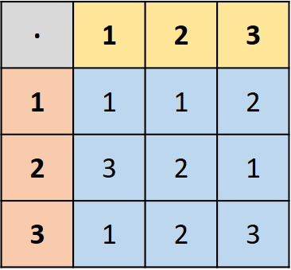

图1.1 判断有限集是否封闭

左上角表示二元运算符，第一行表示集合 $A$，第一列也表示集合 $A$，剩余部分表示二元运算结果，可见运算结果和集合包含的元素是一致的。所以，判断是否封闭，我们只需要判断各部分间元素是否均相同即可（备注：运算结果可以为集合 $A$ 的子群）。

&emsp;&emsp;群具有四个性质：封闭性（$\forall a,b \in G \Rightarrow a \cdot b \in G$）、结合律、单位元素、逆元素。我们定义 $a,b,c$ 为集合 $G$ 中的元素，即 $a,b,c\in G$，$e$ 为集合 $G$ 的单位元素，且 $e\in G$ ，集合 $G$ 中的每一个元素均可逆，那么有下述等式恒成立（这里的 $\cdot$ 必须满足二元运算）：

（等式1：结合律）$a \cdot(b \cdot c)=(a \cdot b) \cdot c$

（等式2：单位元）$a \cdot e=e \cdot a=a$

（等式3：逆元素）对于集合 $G$ 中的每一个元素 $a$，$a \in G$，都有 $a^{-1} \in G$，满足 $a \cdot a^{-1}=a^{-1} \cdot a=e$

&emsp;&emsp;交换律：对于群 $G$ 中任意的两个元素 $a,b$ ，即 $a,b \in G$，若 $a \cdot b=b \cdot a$，那么我们称群 $G$ 是可交换的，也称之为阿贝尔群。若图1.1中蓝色部分组成的方阵中的元素关于主对角线对称，即 $a_{ij}=a_{ji}$，此时就满足交换律。

&emsp;&emsp;两个实数集 $M$ 使用二元运算符 $\cdot$ 进行运算：$M \times M \rightarrow M$，若元素仅仅满足结合律（<u>当元素个数较少时，我们可以遍历每一种情况判断是否相等</u>）和单位元，那么我们将其称作独异点。例如，两个由自然数组成的集合 $\mathbb{N}=\{0,1,\cdots,n,\cdots \}$ 进行加法运算，构成可交换独异点，但由于其不满足等式3，所以不能被称为群。我们接下来给出几个群的例子供大家学习。

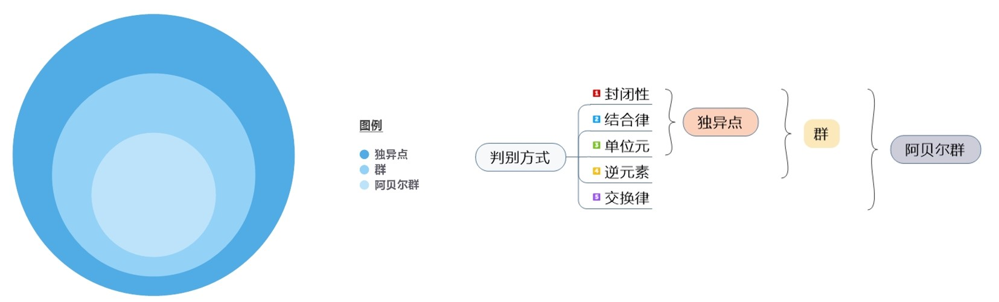

图1.2 群的判断

**示例1.1：**

&emsp;&emsp;1. 将两个集合 $\mathbb{Z}=\{\cdots,-n,\cdots,-1,0,1,\cdots,n,\cdots\}$ 进行相加便构成一个单位元为0的阿贝尔群。但是两个 $\mathbb{Z}^*$ 进行相乘并不能得到群，其中 $\mathbb{Z}^*=\mathbb{Z}-\{0\}$ 。分析过程如下：

（1） 相加

&emsp;&emsp;a、封闭性：$\forall a,b \in \mathbb{Z}$，我们都有 $a+b \in \mathbb{Z}$，所以满足封闭性。

&emsp;&emsp;b、结合律：$\forall a,b,c \in \mathbb{Z}$，我们都有 $(a+b)+c=a+(b+c)$，所以满足结合律。

&emsp;&emsp;c、单位元：$\forall a \in \mathbb{Z}$，我们都有 $a+0=0+a=a$，所以满足单位元。

&emsp;&emsp;d、逆元素：$\forall a \in \mathbb{Z}$，我们都有 $a+b=0$，且 $b \in \mathbb{Z}$，所以满足逆元素。

&emsp;&emsp;e、交换律：$\forall a,b \in \mathbb{Z}$，我们都有 $a+b=b+a$，所以满足交换律。

&emsp;&emsp;综上，$\mathbb{Z}$ 是单位元为0的阿贝尔群。

（2） 相乘

&emsp;&emsp;a、封闭性：$\forall a,b \in \mathbb{Z}^*$，我们都有 $a \times b \in \mathbb{Z}^*$，所以满足封闭性。

&emsp;&emsp;b、结合律：$\forall a,b,c \in \mathbb{Z}^*$，我们都有 $(a \times b) \times c=a \times (b \times c)$，所以满足结合律。

&emsp;&emsp;c、单位元：$\forall a \in \mathbb{Z}^*$，我们都有 $a \times 1=1 \times a=a$，所以满足单位元。

&emsp;&emsp;d、逆元素：$\forall a \in \mathbb{Z}^*$，我们不一定有 $b \times a=1,b \in \mathbb{Z}^*$，所以不满足逆元素。

&emsp;&emsp;综上，$\mathbb{Z}^*$ 不是群，仅为独异点。需要注意的是 $\mathbb{Z},\mathbb{Z}^*$ 的元素个数均为无限的。

&emsp;&emsp;2. 通过将两个有理数组成的集合 $\mathbb{Q}$（集合中的元素均可写为 $p/q$ 的形式，其中 $p,q\in \mathbb{Z}$ 且 $q\neq0$）进行相加，可以得到一个单位元为0的阿贝尔群。将两个集合 $\mathbb{Q}^*$ 进行相乘也可得到一个单位元为1的阿贝尔群，其中 $\mathbb{Q}^*=\mathbb{Q}-\{0\}$。分析过程如下：

（1） 相加

&emsp;&emsp;a、封闭性：$\forall a,b \in \mathbb{Q}$，我们都有 $a+b \in \mathbb{Q}$，所以满足封闭性。

&emsp;&emsp;b、结合律：$\forall a,b,c \in \mathbb{Q}$，我们都有 $(a+b)+c=a+(b+c)$，所以满足结合律。

&emsp;&emsp;c、单位元：$\forall a \in \mathbb{Q}$，我们都有 $a+0=0+a=a$，所以满足单位元。

&emsp;&emsp;d、逆元素：$\forall a \in \mathbb{Q}$，我们都有 $a+b=0,b \in \mathbb{Q}$，所以满足逆元素。

&emsp;&emsp;e、交换律：$a,b \in \mathbb{Q}$，我们都有 $a+b=b+a$，所以满足交换律。

&emsp;&emsp;综上，$\mathbb{Q}$ 是单位元为0的阿贝尔群。

（2） 相乘

&emsp;&emsp;a、封闭性：$\forall a,b \in \mathbb{Q}^*$，我们都有 $a \times b \in \mathbb{Q}^*$，所以满足封闭性。

&emsp;&emsp;b、结合律：$\forall a,b,c \in \mathbb{Q}^*$，我们都有 $(a \times b) \times c=a \times (b \times c)$，所以满足结合律。

&emsp;&emsp;c、单位元：$\forall a \in \mathbb{Q}^*$，我们都有 $a \times 1=1 \times a=a$，所以满足单位元。

&emsp;&emsp;d、逆元素：$\forall a \in \mathbb{Q}^*$，我们都有 $a \times b=1,b \in \mathbb{Q}^*$，所以满足逆元素。

&emsp;&emsp;e、交换律：$a,b \in \mathbb{Q}^*$，我们都有 $a \times b=b \times a$，所以满足交换律。

&emsp;&emsp;综上，$\mathbb{Q}^*$ 是单位元为1的阿贝尔群。需要注意的是 $\mathbb{Q},\mathbb{Q}^*$ 的元素个数均为无限的。

&emsp;&emsp;我们发现上述的群都满足交换律，那么有没有不满足交换律的群呢？我们在这里给出一个例子加以说明。 $M^+$ 为由无穷个 $n \times n$ 的可逆方阵（行列式不为0，且元素均为实数）构成的集合，那么 $M^+ \times M^+$ 是不是群呢？分析过程如下：

&emsp;&emsp;a、封闭性：我们取 $\forall A,B \in M^+$，都有 $A \times B \in M^+$，所以满足封闭性。

&emsp;&emsp;b、结合律：$\forall A,B,C \in M^+$，都有 $(A \times B) \times C=A \times (B \times C)$，所以满足结合律（矩阵乘法满足结合律）。

&emsp;&emsp;c、单位元：$\forall A \in M^+$，都有 $A \times I_n = I_n \times A=A$，所以满足单位元，其中 $I_n$ 为 $n$ 阶单位阵。

&emsp;&emsp;d、逆元素：$\forall A \in M^+$，都有 $A \times B=I_n$，其中 $B=A^{-1}$，所以满足逆元素。

&emsp;&emsp;e、交换律：$\forall A,B \in M^+$，一般而言 $A \times B \neq B \times A$，所以不满足交换律。

&emsp;&emsp;综上，$M^+$ 是一个单位元为 $I_n$ 的群。

&emsp;&emsp;3. 给定一个非空集合 $S$，若有作用方式 $f$ 可以使两个相同集合 $S$ 之间满足双射关系（也可称为 $S$ 的排列），即 $f:S\rightarrow S$，此时，通过函数与函数之间的运算便可构成一个群（例如，将函数 $f$ 和函数 $g$ 通过复合运算得到计算结果 $f \circ g$，其中 $f$ 和 $g$ 均可使集合 $S$ 到其自身之间满足一一映射），当集合 $S$ 中的元素个数超过两个时，所构成的群并不是一个阿贝尔群。集合 $S=\{1,\cdots,n\}$ 所构成的置换群通常被记作 $S_n$，也被称为 $n$ 个元素构成的对称群。举例如下：

设 $S=\{1, 2, 3\}$，我们定义 $f$ 的映射关系为：
$$
f:S \rightarrow S,f=\{(1,2),(2,3),(3,1)\} \\
f^{-1}:S \rightarrow S,f^{-1}=\{(1,3),(2,1),(3,2)\}
$$
同时定义 $g$ 的映射关系为：
$$
g:S\rightarrow S,g=\{(1,3),(2,1),(3,2)\} \\
g^{-1}:S\rightarrow S,g^{-1}=\{(1,2),(2,3),(3,1)\}
$$
$h$ 的映射关系为：
$$
h:S\rightarrow S,h=\{(1,2),(2,1),(3,3)\} \\
h^{-1}:S\rightarrow S,h^{-1}=\{(1,2),(2,1),(3,3)\}
$$

则，我们有 $f \circ g$ 的计算结果：
$$
f \circ g:S\rightarrow S,f \circ g=\{(1,1),(2,2),(3,3)\}
$$
可知，$f \circ g$ 的复合结果依然为满射，且其逆过程为：
$$
(f \circ g)^{-1}:S\rightarrow S,(f \circ g)^{-1}=\{(1,1),(2,2),(3,3)\}
$$
接下来我们利用群的相关定义进行验证，其中我们将 $f \circ g \circ h$ 记作 $\varphi$，那么其逆过程记为 $\varphi^{-1}$：

&emsp;&emsp;封闭性：$\forall \ a \in S$，都有 $\varphi(a) \in S$，所以满足封闭性；

&emsp;&emsp;结合律：$\forall \ a \in S$，都有 $(f \circ g) \circ h=f \circ (g \circ h)$，所以满足结合律；

&emsp;&emsp;单位元：不难发现 $f \circ g$ 构成了恒同映射，即 $\forall a \in S,f \circ g(a)=a$，所以 $\forall a \in S,f \circ g \circ h(a)=h \circ f \circ g(a)=h(a)$；

&emsp;&emsp;逆映射：对于每一个$a \in S$，均有 $f \circ g \circ h \circ (f \circ g \circ h(a))^{-1}=(f \circ g \circ h)^{-1} \circ f \circ g \circ h(a)=f \circ g(a)$

&emsp;&emsp;故而 $f \circ g \circ h(a)$ 的复合结果为群，且为对称群。这部分知识来自于[知乎专栏](https://zhuanlan.zhihu.com/p/85203425)。

&emsp;&emsp;4. 对于任意的正整数 $p \in \mathbb{N}$，定义在 $\mathbb{Z}$ 上的同余关系记作 $m \equiv n \ (mod\ p)$，具体定义如下：

$$
m \equiv n \ (mod\ p) \ \Leftrightarrow \ \exists  \ k \in \mathbb{Z}, \ m-n=kp
$$
其中，$\equiv$ 表示同余符号，即 $m \ mod \ p \equiv n \ mod \ p$ ，读者很容易证明这是一个恒等关系，此外，将同余号两边同时进行相加或相乘，相等关系不变，即若 $m_1 \equiv n_1 \ (mod\ p)$ 且 $m_2 \equiv n_2 \ (mod\ p)$ ，则 $m_1+m_2 \equiv n_1+n_2 \ (mod\ p)$ ， $m_1m_2 \equiv n_1n_2 \ (mod\ p)$ 。我们在这里给出一个算例：
$$
5 \equiv 3 \ (mod \ 2)\\
11 \equiv 7 \ (mod \ 2)\\ \Rightarrow
加运算：16 \equiv 10 \ (mod \ 2)\\\Rightarrow
乘运算：55 \equiv 21 \ (mod \ 2)
$$
我们将一组等价类对 $p$ 取余的相加和相乘操作用如下记号进行表示：
$$
[m]+[n]=[m+n]\\
[m] \cdot [n]=[mn]
$$
读者很容易证明将一组对 $p$ 取余的同余类进行相加可以得到单位元为 $[0]$ 的阿贝尔群，我们将这个群记作 $\mathbb{Z}/p\mathbb{Z}$ 。分析过程如下：

根据上面的定义，我们可以用 $[n]$ 表示对 $p$ 取余为 $n$ 的同余类，那么该集合可以表示为 $[n]=\{a\ | \ a=kp+n,k \in \mathbb{Z}\}$。

&emsp;&emsp;封闭性：$\forall \ [a],[b] \in \mathbb{Z}$，都有 $[a+b] \in \mathbb{Z}$，所以满足封闭性；

&emsp;&emsp;结合律：$\forall \ [a],[b],[c] \in \mathbb{Z}$，都有 $[a+b]+[c]=[a]+[b+c]$，所以满足结合律；

&emsp;&emsp;单位元：$\forall \ [a] \in \mathbb{Z}$，都有 $[a]+[0]=[0]+[a]=[a]$，所以满足单位元；

&emsp;&emsp;逆元素：$\forall \ [a] \in \mathbb{Z}$，都有 $[a]+[-a]=[-a]+[a]=[0]$，且 $[-a] \in \mathbb{Z}$，所以满足逆元素；

&emsp;&emsp;交换律：$\forall \ [a],[b] \in \mathbb{Z}$，都有 $[a]+[b]=[b]+[a]$，所以满足交换律。

&emsp;&emsp;综上，$\mathbb{Z}/p\mathbb{Z}=\{[0],[1],[2],\cdots,[p-1]\}$ 是一个单位元为 $[0]$ 的阿贝尔群。这里我们需要注意的是 $[-a]=[p-a]$。

&emsp;&emsp;5. 将一组元素为实数或复数的 $n \times n$ 的可逆矩阵进行相乘可以得到一个单位元为单位矩阵 $I_n$ 的群，这个群被称为一般线性群，对于矩阵元素为实数的记作 $GL(n,\mathbb{R})$，对于矩阵元素为复数的记作 $GL(n,\mathbb{C})$ 。假设我们有 $n$ 阶可逆矩阵 $A,B,C$ ，则有如下计算过程（和2相结合分析）：
$$
结合律：(A \times B) \times C = A \times (B \times C)\\
单位元：A \times I = I \times A = A\\
逆元素：A \times A^{-1} = A^{-1} \times A = I
$$
注：$\because$ 矩阵可逆的充要条件之一是它的行列式不等于0，$\therefore$ 两个可逆矩阵相乘得到矩阵仍然是可逆矩阵。

&emsp;&emsp;6. 将一组元素为实数或复数的 $n \times n$ 的可逆矩阵 $A$ 进行相乘，其中矩阵的行列式为1，即 $det(A)=1$ ，可以得到一个单位元为单位矩阵 $I_n$ 的群，这个群被称为特殊线性群，对于元素为实数的记作 $SL(n,\mathbb{R})$， 对于元素为复数的记作 $SL(n,\mathbb{C})$ 。证明方式如5。

&emsp;&emsp;7. 将一组元素为实数的 $n \times n$ 的矩阵 $Q$ 进行相乘，可以得到一个单位元为单位矩阵 $I_n$ 的群，其中矩阵 $Q$ 满足 $QQ^T=Q^TQ=I_n$ 。我们有 $Q^{-1}=Q^T$ ，这个群被称为正交群，记作 $O(n)$。我们接下来将给出正交阵的定义：

&emsp;&emsp;令 $n$ 阶矩阵 $M$ 包含如下元素 $M=(v_1 \ v_2 \ \cdots \ v_n)$，其中 $v_i$ 是第 $i$ 个列向量，且元素个数为 $n$。现在，我们来考虑 $M \times M$ 的计算过程。
$$
M^T \times M=
\left(
 \begin{matrix}
   v_1\\
   v_2\\
   \vdots\\
   v_n
 \end{matrix}
\right) \ \times \
\left(
 \begin{matrix}
   v_1 & v_2 & \ldots & v_n
 \end{matrix}
\right)=
\left(
 \begin{matrix}
   v_1 \cdot v_1 & v_1 \cdot v_2 & \ldots & v_1 \cdot v_n\\
   v_2 \cdot v_1 & v_2 \cdot v_2 & \ldots & v_2 \cdot v_n\\
   v_3 \cdot v_1 & v_3 \cdot v_2 & \ldots & v_3 \cdot v_n\\
   \vdots & \vdots & \ddots & \vdots\\
   v_n \cdot v_1 & v_n \cdot v_2 & \ldots & v_n \cdot v_n
 \end{matrix}
\right)
$$

&emsp;&emsp;矩阵 $M$ 中的向量 $v_i$ 之间满足两两正交，即
$$
若i=j, \ \ v_i \cdot v_j=1\\
若i \neq j, \ \ v_i \cdot v_j=0
$$

&emsp;&emsp;我们分析一下这里的等式，向量之间的点积也称为向量之间的内积 $v_i \cdot v_j=|v_i| \times |v_j| \times cos<v_i,v_j>$，所以内积能够描述两向量之间的位置关系，当其垂直时，内积为0；当其平行时，内积为向量长度的乘积。所以，正交意味着不同向量之间为垂直关系，且每个向量的模长均为1。鉴于此，我们便有如下等式：
$$
M^T \times M =
\left(
 \begin{matrix}
   1 & 0 & 0 & \ldots & 0\\
   0 & 1 & 0 & \ldots & 0\\
   0 & 0 & 1 & \ldots & 0\\
   \vdots & \vdots & \vdots & \ddots & \vdots\\
   0 & 0 & 0 & \ldots & 1
 \end{matrix}
\right)=I
$$

&emsp;&emsp;8. 将一组元素为实数的 $n \times n$ 的矩阵 $Q$ 进行相乘，可以得到一个单位元为单位矩阵 $I_n$ 的群，其中矩阵 $Q$ 满足 $QQ^T=Q^TQ=I_n \ 且 \ det(Q)=1$ 。就像示例7中一样，我们有 $Q^{-1}=Q^T$  ，这个群被称为特殊正交群或旋转群，记作 $SO(n)$。

&emsp;&emsp;在示例5~8中，除了 $SO(2)$ 为阿贝尔群以外，当 $n \geq 2$ 时均为非阿贝尔群。我们通常将集合相加后得到的阿贝尔群用 $G$ 进行表示，此时元素 $a \in G$ 的逆元 $a^{-1}$ 可以表示为 $-a$ 。群的单位元（幺元）是独一无二的，我们可以得到一些更一般的结论。

**命题1.1：** 若有二元运算符 $\cdot$ : 使得 $M \times M \rightarrow M$ 的计算结果是一个群，且 $e' \in M$ 是左单位元，$e'' \in M$ 是右单位元，也即：
$$
G2l:\ \ 对于任意的\  a \in M \ \ 都有 \ \ e' \cdot a = a \\
G2r:\ \ 对于任意的\  a \in M \ \ 都有 \ \ a \cdot e'' = a
$$
那么我们有 $e'=e''$ 。

证明过程如下：若我们令等式 $G2l$ 中 $a=e''$，那么我们有：
$$
e' \cdot e'' = e''
$$
若我们令等式 $G2r$ 中 $a=e'$，我们有：
$$
e' \cdot e'' = e'
$$
那么，我们得到如下等式：
$$
e' = e' \cdot e'' = e''
$$
综上，我们便得到了 $e'=e''$ （存在且唯一）。

&emsp;&emsp;**命题1.1**说明了独异点的幺元是唯一的，而所有的群都是独异点，所以群的幺元都是唯一的。此外，群中的每一个元素都有其对应的逆元，接下来我们给出一个命题：

**命题1.2：** 在独异点 $M$ 中有幺元 $e$ ，若某元素 $a \in M$ 有左逆元 $a' \in M$ 和右逆元 $a'' \in M$，也即：
$$
G3l:\ \ a' \cdot a = e\\
G3r:\ \ a \cdot a'' = e
$$
则有 $a'=a''$。

证明过程如下：结合公式 $G3l$ 以及 $e$ 为群的幺元，我们可以得到
$$
(a' \cdot a) \cdot a'' = e \cdot a'' = a''
$$
同样的，结合公式 $G3r$ 以及 $e$ 为群的幺元，我们可以得到
$$
a' \cdot (a \cdot a'') = a' \cdot e = a'
$$
由于 $M$ 是独异点，所以二元运算符 $\cdot$ 符合结合律，故而有
$$
a' = a' \cdot (a \cdot a'') = (a' \cdot a) \cdot a'' = a''
$$
得证 $a'=a''$ （存在且唯一）。

**注意：** 群的单位元（等式2）以及群的逆元素（等式3）的证明可以被弱化为仅要求 $G2r$ （右单位元存在）和 $G3r$ （对于群中每一个元素均存在右逆元）存在（或者是 $G2l$ 和 $G3l$ 存在）。通过证明 $G2l$ 和 $G3l$ 成立来证明等式2（公理2）以及等式3（公理3）成立是一个行之有效的方法。

**定义1.2：** 若群 $G$ 由有限的 $n$ 个元素组成，我们称群 $G$ 为 $n$ 阶群。若群 $G$ 的元素个数是无穷的，我们称群 $G$ 为无穷阶群。若群为有限群，那么其阶数我们使用符号 $|G|$ 进行表示。除此之外，我们还可对群中某个元素的阶进行分析。在一个群 $G$ 中，使得满足 $a \cdot a \cdot \ \cdots\  \cdot a=e$ （共计 $n$ 个元素 $a$ 做二元运算）的最小正整数 $n$ 叫做 $a$ 的阶，若这样的 $n$ 不存在，称 $a$ 是无穷阶，或者叫 $a$ 的阶是无穷。

&emsp;&emsp;例如 $G=\mathbb{Z}$，我们有二元运算 $+$，使得 $G + G \rightarrow G$，不难发现 $G$ 是幺元为0的阿贝尔群。那么，当 $a=e$ 时满足 $e=e$，所以 $e$ 的阶为1，对于其它 $a \neq e$ 的元素呢，显然不论多少个 $a$ 进行相加都得不到 $e$，所以我们说这些元素阶都是无穷的。

&emsp;&emsp;例如 $G=\mathbb{Q}-\{0\}$，我们有二元运算 $\times$，使得 $G \times G \rightarrow G$，不难发现 $G$ 是幺元为1的阿贝尔群。那么，当 $a=e$ 时满足 $e=e$，所以 $e$ 的阶为1，对于其它 $a \neq e$ 的元素呢，显然-1的偶次幂为1，所以其阶为2，除了1、-1之外，不论多少个 $a$ 进行相乘都得不到 $e$，所以我们说这些元素阶都是无穷的。

&emsp;&emsp;我们目前接触到的群都为无穷阶群，那么有没有有限群呢？我们在这里给出一个例子：集合 $G=\{1,\frac{-1+ \sqrt{3} \imath}{2},\frac{-1- \sqrt{3} \imath}{2}\}$，我们对其做二元运算 $G \times G \rightarrow G$，可以得到单位元为1的阿贝尔群，验证过程如下：

&emsp;&emsp;a、封闭性：1与任何数相乘都为其自身，所以我们只需要验证两个不为1的元素的乘积结果是否是 $G$ 的元素，$\frac{-1+ \sqrt{3} \imath}{2} \times \frac{-1- \sqrt{3} \imath}{2}=1 \in G$，$\frac{-1+ \sqrt{3} \imath}{2} \times \frac{-1+ \sqrt{3} \imath}{2}=\frac{-1- \sqrt{3} \imath}{2} \in G$，$\frac{-1- \sqrt{3} \imath}{2} \times \frac{-1- \sqrt{3} \imath}{2}=\frac{-1+ \sqrt{3} \imath}{2} \in G$，所以满足封闭性；

&emsp;&emsp;b、结合律：由于此处的乘法为普通代数乘法，所以满足结合律；

&emsp;&emsp;c、单位元：$\forall a,b \in G,都有a \times 1=1 \times a=a$，所以满足单位元；

&emsp;&emsp;d、逆元素：$\frac{-1+ \sqrt{3} \imath}{2} \times  \frac{-1- \sqrt{3} \imath}{2}=1$，所以其互逆，而1的逆元就是1，所以满足逆元素；

&emsp;&emsp;e、交换律：普通代数乘法显然满足交换律。

&emsp;&emsp;综上所述，$G$ 为单位元为1的阿贝尔群，且群的阶为3，即 $|G|=3$。我们再来分析一下各元素的阶，不难发现1的阶是1，$\frac{-1+ \sqrt{3} \imath}{2}$ 的阶是3，$\frac{-1- \sqrt{3} \imath}{2}$ 的阶也为3。我们在这里给出群 $G$ 的乘法表：

|            $\times$             |                1                | $\frac{-1+ \sqrt{3} \imath}{2}$ | $\frac{-1- \sqrt{3} \imath}{2}$ |
|:-------------------------------:|:-------------------------------:|:-------------------------------:|:-------------------------------:|
|                1                |                1                | $\frac{-1+ \sqrt{3} \imath}{2}$ | $\frac{-1- \sqrt{3} \imath}{2}$ |
| $\frac{-1+ \sqrt{3} \imath}{2}$ | $\frac{-1+ \sqrt{3} \imath}{2}$ | $\frac{-1- \sqrt{3} \imath}{2}$ |                1                |
| $\frac{-1- \sqrt{3} \imath}{2}$ | $\frac{-1- \sqrt{3} \imath}{2}$ |                1                | $\frac{-1+ \sqrt{3} \imath}{2}$ |
不难发现其乘积结果部分组成矩阵的元素关于主对角线对称，矩阵所对应行列式的值为0，所以不可逆。我们接下来给出几个有限群的例子加以学习：这部分知识来自于[百度文库](https://wenku.baidu.com/view/56ef1e1d4b35eefdc8d33373.html)。

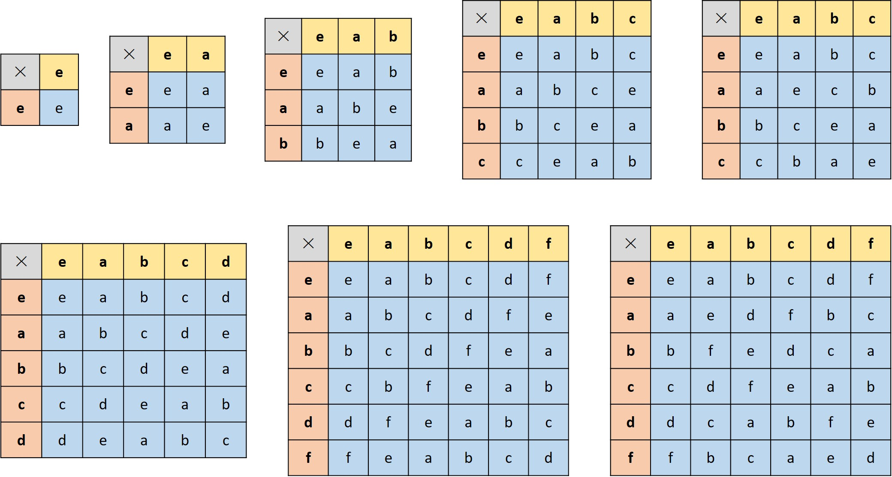

对于给定的群 $G$ ，对于任意的两个子集 $R,S \subseteq G$，我们令
$$
RS=\{r \cdot s\ |\ r \in R,\ s \in S\}
$$
特殊的，对于任意的 $g \in G$，如果 $R=\{g\}$，我们记作
$$
gS=\{g \cdot s\ |\ s \in S\}
$$
同样的，如果 $S=\{g\}$，我们记作
$$
Rg=\{r \cdot g\ |\ r \in R\}
$$
&emsp;&emsp;从现在开始，我们将乘法运算符进行省略，将 $g_1 \cdot g_2$ 写作 $g_1g_2$。

**定义1.3：** $G$ 为一个群，对于任意的 $g \in G$，我们令 $L_g$ 表示用 $g$ 左平移，具体计算方式为对于任意的 $a \in G$ 有 $L_g(a)=ga$。同样的，我们令 $R_g$ 表示用 $g$ 右平移，计算方式为对于任意的 $a \in G$ 有 $R_g(a)=ag$。

&emsp;&emsp;我们会经常用到下面这些简单的结论。

**命题1.3：** 给定群 $G$，其左平移 $L_g$ 和右平移 $R_g$ 得到的结果均满足双射。我们在这里仅给出左平移 $L_g$ 的证明过程，右平移 $R_g$ 的证明方式类似，证明方式如下：

&emsp;&emsp;若 $L_g(a)=L_g(b)$，那么有 $ga=gb$，我们在等式两边同乘 $g^{-1}$，便可得到 $a=b$，所以 $L_g$ 满足单射。对于任意的 $b \in G$，我们有 $L_g(g^{-1}b)=gg^{-1}b=b$，所以 $L_g$ 满足满射。因此，$L_g$ 满足双射。

&emsp;&emsp;我们在这里给出单射、满射以及双射的图解表示：

图1.3 单射、满射、双射的示意图

&emsp;&emsp;特殊的，若映射过程的定义域和值域一样，我们将这个过程称之为变换，即有作用方式 $\varphi$，使得 $A \rightarrow A$。为了方便起见，我们在这里将映射后的结果记为 $\bar{A}$。

&emsp;&emsp;若我们定义 $A$ 上的二元运算为 $\cdot$，$\bar{A}$ 上的二元运算为 $\bar{\cdot}$ （此处的 $A$ 和 $\bar{A} 不一定相同$），对于 $A$ 中的元素 $a$ 经过作用方法 $\varphi$ 后得到 $\bar{a}$。那么，若我们定义 $A$ 上有两个元素进行二元运算 $a \cdot b$，经过函数映射后其计算结果为 $\varphi(a \cdot b)= \overline{a \cdot b}$，而对于每一个元素又都有 $\varphi(a)=\bar{a} \in \bar{A}$，$\varphi(b)=\bar{b} \in \bar{A}$，如果满足 $a \cdot b \rightarrow \bar{a} \bar{\cdot} \bar{b}$ （或者写成 $\overline{a \cdot b}=\bar{a} \bar{\cdot} \bar{b}$），称 $\varphi$ 是 $A$ 到 $\bar{A}$ 的同态映射。我们在这里给出一些例子方便大家理解：

图1.4 同态映射的判断方式

其中“象”指函数对变量的映射结果。

&emsp;&emsp;1、我们令 $A=\mathbb{R}$，$\bar{A}=\mathbb{R}^+$，其中 $A$ 上的二元运算为 $+$，$\bar{A}$ 上的二元运算为 $\times$，作用方式 $\varphi$ 为 $x \rightarrow e^x$，即求某一个变量的指数函数值。那么，$\forall x,y \in A,\overline{x+y}=e^{x+y}=e^{x}e^{y}=\bar{x}\bar{y}=\bar{x} \times \bar{y}$，故而为同态映射。这里的作用方式为双射。

&emsp;&emsp;2、我们有 $A=\mathbb{Z}$，$A$ 上的二元运算为 $+$，$\bar{A}=\{1,-1\}$，$\bar{A}$ 上的二元运算为 $\times$，作用方式 $\varphi_1: \forall a \in A, a \rightarrow 1$。不难发现，$\forall a,b \in A$ 有 $a \cdot b = a+b \in A$，所以 $\overline{a+b}=\varphi_1(a+b)=1$。而对于 $\bar{a} \bar{\cdot} \bar{b}=\varphi_1(a) \times \varphi_1(b)=1 \times 1=1$，综上，$\overline{a+b}=\bar{a} \bar{\cdot} \bar{b}$，所以为同态映射。这里的作用方式为非满射，非单射。

&emsp;&emsp;3、在2中若把映射方式改为 $\varphi_2: \forall a \in A, a \rightarrow -1$，此时不难发现 $\overline{a+b}=\varphi_2(a+b)=-1$，$\bar{a} \bar{\cdot} \bar{b}=\varphi_2(a) \times \varphi_2(b)=(-1) \times (-1)=1$，故而不为同态映射。

&emsp;&emsp;4、在2中若把映射方式改为 $\varphi_3: \forall a为奇数 \in A, a \rightarrow -1，\forall a为偶数 \in A, a \rightarrow 1$。此时为同态映射。这里的作用方式为满射。

&emsp;&emsp;需要注意的是 $A$ 与 $\bar{A}$ 有同态映射且作用方式为满射我们才称 $A$ 与 $\bar{A}$ 同态，例如例4。当映射方式为双射时，此时我们称之为同构，例如例1，我们将其记为 $A \cong \bar{A}$。我们先给出同态的一些性质：

&emsp;&emsp;假定对于代数运算 $\cdot$ 与 $\bar{\cdot}$ 来说，$A$ 与 $\bar{A}$ 同态，那么（1）若 $\cdot$ 满足结合律，则 $\bar{\cdot}$ 也满足结合律；（2）若 $\cdot$ 满足交换律，则 $\bar{\cdot}$ 也满足交换律。

&emsp;&emsp;我们再对同构进行分析，我们先给出一个例子：有 $A=\{1,2,3\}$，$\bar{A}=\{4,5,6\}$，$A$ 上的二元运算方式 $\cdot$ 如表1，$\bar{A}$ 上的二元运算方式 $\bar{\cdot}$ 如表2，$\varphi$ 是 $A \rightarrow \bar{A}$ 的映射，映射关系如表3：

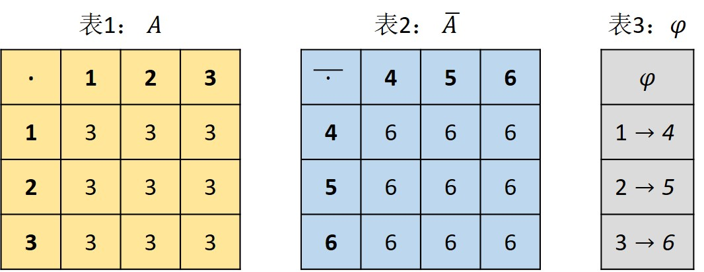

不难发现 $\varphi$ 是一个映射，且 $A$ 中的元素均有象且唯一。由于 $\varphi(a \cdot b)=\varphi(3)=6$，且 $\varphi(a) \bar{\cdot} \varphi(b)=6$，故而满足同态映射。$\varphi$ 满足双射。综合分析可知，$A \cong \bar{A}$，即满足同构。

&emsp;&emsp;那么，如果我们将 $\bar{\cdot}$ 的计算方式修改为 $\forall x,y \in \bar{A},x \bar{\cdot} y=5$，此时 $A$ 与 $\bar{A}$ 还满足同构吗？答案是肯定的，虽然此时的 $\varphi$ 不能满足同态映射，但是我们能找到 $\varphi'$ 使其满足同态映射，比如 $1 \rightarrow 4, 2 \rightarrow 6, 3 \rightarrow 5$，那么 $\varphi'$ 就可使 $A \cong \bar{A}$，所以还是满足同构的。综上，我们只要能找到一个（**存在**）映射方式（<u>这个映射方式不一定是给定的</u>），使得 $A \cong \bar{A}$，我们便说它们之间是同构的。这个存在的映射方式（同构映射）需要满足以下4点：

（1） $\varphi'$ 是 $A$ 到 $\bar{A}$ 的映射；

（2） $\varphi'$ 是同态映射；

（3） $\varphi'$ 是满射；

（4） $\varphi'$ 是单射。

&emsp;&emsp;特殊的，若 $\bar{A}=A$ 且 $A \cong \bar{A}$，那么我们将映射 $\varphi$ 称之为 $A$ 的自同构。举例如下：

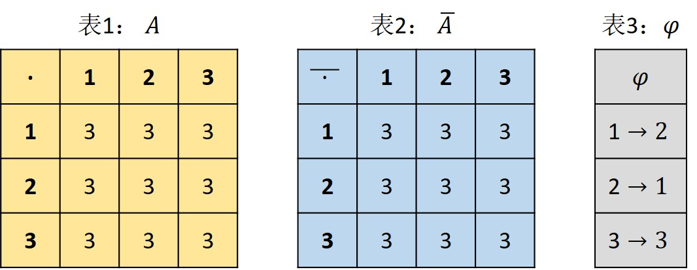

**定义1.4：** 给定一个群 $G$ ，$G$ 的子集 $H$ 是其子群的充要条件是：

（1） $G$ 的幺元 $e$ 也是 $H$ 的元素（$e \in H$）;

（2） 对于所有的 $h_1,h_2 \in H$，都有 $h_1h_2 \in H$;

（3） 对于所有的 $h \in H$，都有 $h^{-1} \in H$。

&emsp;&emsp;定义的证明：我们先证明充分性 $\Leftarrow$，封闭性——由于 $\forall \  h_1,h_2 \in H,h_1h_2 \in H$，所以满足封闭性。结合律——乘法满足结合律。单位元——根据 $\forall \ h_1 \in H,h_1^{-1} \in H$，且 $\forall \ h_1,h_2 \in H,h_1h_2 \in H$，所以 $h_1h_1^{-1} \in H$，我们将 $h_1h_1^{-1}$ 记作 $e$，那么 $e \in H$。逆元素——由于 $\forall \ h,h^{-1} \in H,h^{-1}h=e$，所以逆元存在；我们再证明必要性 $\Rightarrow$，若 $H$ 为 $G$ 的子群，那么 $H$ 必须满足封闭性，所以能推出（2）。我们将群 $H$ 中的单位元记为 $e'$ （因为此处我们还不能确定子群的单位元是否等于群的单位元），$\forall \ a \in H,e'a=a$，同时由于 $H$ 是 $G$ 的子集，所以 $e',a \in G$，我们又知在 $G$ 中 $ea=a$，所以 $e'=e$，<u>即 $G$ 中的单位元就是 $H$ 中的单位元</u>。由于 $H$ 是一个群，那么 $\forall \ h \in H,hh^{-1}=e\ 且  \ h^{-1} \in H$，由于 $H$ 是 $G$ 的子集，所以 $h,h^{-1} \in G$，而在 $G$ 中显然有 $hh'=e$，所以 $h^{-1}=h'$，<u>即任意元素在群中的逆元素和子群中的逆元素相等</u>。

&emsp;&emsp;命题1.4的证明过程我们留作练习。

**命题1.4：** 给定一个群 $G$，其子集 $H \subseteq G$ 是群 $G$ 的子群 $\Leftrightarrow$ $H$ 非空且对于任意的 $h_1,h_2 \in H$，都有 $h_1h_2^{-1} \in H$。

&emsp;&emsp;命题的证明：我们先证明必要性 $\Rightarrow$，$\forall \ h_1,h_2 \in H$，由定义1.4的（3）知 $h_2^{-1} \in H$，再结合定义1.4的（2）知 $h_1h_2^{-1} \in H$；我们再证明充分性 $\Leftarrow$，$\forall \ h_1 \in H$，都有 $h_1h_1^{-1}=e \in H$，那么此时 $h_1h_1^{-1},h_1 \in H$，所以 $h_1h_1^{-1}h_1^{-1}=eh_1^{-1}=h_1^{-1} \in H$。由上一步知 $\forall \ h_1,h_2 \in H$，有 $h_1,h_2^{-1} \in H$，所以有 $h_1(h_2^{-1})^{-1}=h_1h_2 \in H$。

&emsp;&emsp;若群 $G$ 是有限群，那么可以使用下述判断方法。

**命题1.5：** 给定有限群 $G$，其子集 $H \subseteq G$ 是群 $G$ 的子群 $\Leftrightarrow$ （1） $e \in H$; （2） 两个 $H$ 做乘积运算后得到的结果是封闭的。

证明：我们先证明必要性 $\Rightarrow$，由于 $H$ 是 $G$ 的子群，所以其肯定满足封闭性且具有单位元 $e$；我们再证明充分性 $\Leftarrow$，封闭性——命题1.5的（2）就是封闭性的定义。结合律——乘积运算满足结合律。单位元——命题1.5的（1）就是单位元。逆元素—— $\forall \ a \in H$，根据封闭性可知 $a,a^1,a^2,\cdots,a^n \in H$，因为 $H$ 的元素个数有限，所以 $\exists \ i,j \in \mathbb{N} \ (j>i) \ ,使得 \ a^i=a^j$，这里是为什么呢？若某个元素的 $n$ 次幂之间都不相等，那必然造成集合元素个数是无穷的，这与元素个数有限相悖，所以要使集合的元素个数有限，那元素的 $n$ 次幂的计算结果之间一定存在"周期性"。不难发现 $a^j=a^ia^{j-i}$，由于 $a^i=a^j$，那么 $a^{j-i}=1$，也即 $aa^{j-i-1}=1$。若 $j-i>1$，那么 $a^{-1}=a^{j-i-1} \in H$。若 $j-i=1$，那么 $a=1$，故而 $a^{-1}=a \in H$，因此 $\forall \ a \in H,都有  \ a^{-1} \in H,且 \ aa^{-1}=e \in H$。得证逆元素存在。综上所述，命题1.5成立。这部分知识来自于[百度文库](https://wenku.baidu.com/view/3e3b660a79563c1ec5da7184.html?sxts=1583120406111)。

**示例1.2：**

&emsp;&emsp;1. 对于任意的整数 $n \in \mathbb{Z}$，集合 $n\mathbb{Z}=\{nk\ |\ k \in \mathbb{Z}\}$ 是群 $\mathbb{Z}$ 的子群。

&emsp;&emsp;2. 对于 $n \times n$ 的可逆矩阵而言，若其满足 $GL^{+}(n,\mathbb{R})=\{A \in GL(n,\mathbb{R})\ |\ det(A)>0\}$，此时 $GL^{+}(n,\mathbb{R})$ 是群 $GL(n,\mathbb{R})$ 的子群。

&emsp;&emsp;3. 群 $SL(n,\mathbb{R})$ 是群 $GL(n,\mathbb{R})$ 的子群。

&emsp;&emsp;4. 群 $O(n)$ 是群 $GL(n,\mathbb{R})$ 的子群。

&emsp;&emsp;5. 群 $SO(n)$ 是群 $O(n)$ 的子群，同时也是群 $SL(n,\mathbb{R})$ 的子群。

&emsp;&emsp;6. 不难发现，每一个 $2 \times 2$ 的旋转矩阵 $R \in SO(2)$ 都可以被写作
$$
R=
\left(
 \begin{matrix}
   \cos \theta & -\sin \theta\\
   \sin \theta & \cos \theta
 \end{matrix}
\right),\ \ \ 其中\ 0 \leq \theta < 2\pi
$$
&emsp;&emsp;  我们在这里给出二阶矩阵的逆矩阵的计算方法
$$
\left(
 \begin{matrix}
   a & b\\
   c & d
 \end{matrix}
\right)^{-1}=\frac{1}{ad-bc}
\left(
 \begin{matrix}
   d & -b\\
   -c & a
 \end{matrix}
\right)
$$

&emsp;&emsp;  在下例中，$SO(2)$ 可以被看作是 $SO(3)$ 的子群
$$
R=
\left(
 \begin{matrix}
   \cos \theta & -\sin \theta\\
   \sin \theta & \cos \theta
 \end{matrix}
\right),\ \
Q=
\left(
 \begin{matrix}
   \cos \theta & -\sin \theta & 0\\
   \sin \theta & \cos \theta & 0\\
   0 & 0 & 1
 \end{matrix}
\right)
$$
&emsp;&emsp; 我们在这里给出旋转矩阵的定义，首先观察下图：

图1.4 绕原点二维旋转

&emsp;&emsp;首先我们需要明确的是，二维旋转是围绕坐标原点旋转，如图1.4所示。图中点 $V$ 绕原点逆时针转过 $\theta$ 角到达 $V'$ 点处。假设点 $V$ 的坐标为 $(x,y)$，那么 $V'$ 点的坐标为 $(x',y')$，其中点 $V$ 到原点的距离为 $r$，且射线 $OV$ 与 $x$ 轴的夹角为 $\phi$。那么我们能得到如下等式：
$$
x = r \cos \phi, \ \ \ \ y = r \sin \phi\\
x' = r \cos (\theta + \phi), \ \ \ \ y' = r \sin (\theta + \phi)
$$
我们对 $x'$ 和 $y'$ 的等式进行展开可得：
$$
x' = r \cos \theta \cos \phi - r \sin \theta \sin \phi\\
y' = r \sin \theta \cos \phi + r \cos \theta \sin \phi
$$
我们将 $x$ 和 $y$ 的表达式代入上式可得：
$$
x' = x \cos \theta - y \sin \theta, \ \ \ \ y' = x \sin \theta + y \cos \theta
$$
我们将上述结果用矩阵进行表示可得：
$$
\left[
 \begin{matrix}
   x'\\
   y'
 \end{matrix}
\right]=
\left[
 \begin{matrix}
   \cos \theta & -\sin \theta\\
   \sin \theta & \cos \theta
 \end{matrix}
\right]
\left[
 \begin{matrix}
   x\\
   y
 \end{matrix}
\right]
$$
不难发现此处的系数矩阵便是我们的二阶旋转矩阵。那么我们尝试考虑一下三维空间内绕 $x$ 轴旋转的情况是什么样子的呢，我们先给出一个直观的感受。

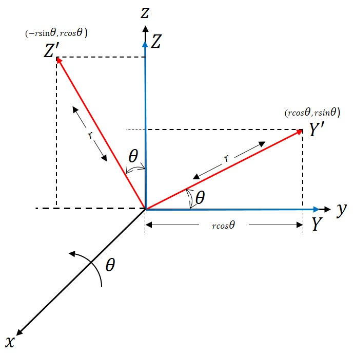

图1.5 绕x轴三维旋转

如图1.5所示，我们对 $OY$ 和 $OZ$ 绕 $x$ 轴旋转 $\theta$ 角度，分别到达 $OY'$ 以及 $OZ'$ 的位置，那么 $Y'$ 的坐标为 $(0,r \cos \theta,r \sin \theta)$，$Z'$ 的坐标为 $(0,-r \sin \theta,r \cos \theta)$，为了简单起见，我们取 $r=1$，那么 $Y$ 的坐标为 $(0,1,0)$，$Z$ 的坐标为 $(0,0,1)$，而 $X$ 的坐标始终不变。所以我们有如下等式：
$$
x' = x\\
y' = y \cos \theta - z \sin \theta \\
z' = y \sin \theta + z \cos \theta
$$
其中，$y',z'$ 的计算方式参见二维情况，我们将上述等式组利用矩阵进行表示如下：
$$
\left[
 \begin{matrix}
   x'\\
   y'\\
   z'
 \end{matrix}
\right]=
\left[
 \begin{matrix}
   1 & 0 & 0\\
   0 & \cos \theta & -\sin \theta\\
   0 & \sin \theta & \cos \theta
 \end{matrix}
\right]
\left[
 \begin{matrix}
   x\\
   y\\
   z
 \end{matrix}
\right]
$$
不难发现此形式和三阶旋转矩阵相同，只是示例6中的三阶旋转矩阵是绕 $z$ 轴旋转得到的。那么，旋转矩阵有什么性质呢？我们以二阶为例进行分析。我们将二阶旋转矩阵记为 $R$ ，不难发现其行列式计算结果为1，且矩阵的转置等于矩阵的逆，也即 $R$ 为正交阵。

&emsp;&emsp;7. 形如下式这种 $2 \times 2$ 的上三角矩阵
$$
\left(
 \begin{matrix}
   a & b\\
   0 & c
 \end{matrix}
\right)\ \ a,b,c \in \mathbb{R}\ \ \ \ a,c \neq 0
$$
&emsp;&emsp; 是群 $GL(2,\mathbb{R})$ 的子群。

&emsp;&emsp;8. 集合 $V$ 由4个矩阵组成，这些矩阵的具体形式如下
$$
\left(
 \begin{matrix}
   \pm 1 & 0\\
   0 & \pm 1
 \end{matrix}
\right)
$$
集合 $V$ 是群 $GL(2,\mathbb{R})$ 的子群，被称为克莱因四元群。

**定义1.5：** 若 $H$ 为 $G$ 的一个子群，并且对于任意的 $g \in G$，形如 $gH$ 的计算方式称为 $H$ 在 $G$ 中的左陪集，形如 $Hg$ 的计算方式称为 $H$ 在 $G$ 中的右陪集。$H$ 的左陪集（右陪集亦同）中包含一种等价关系 $\sim$（$a \sim b \Leftrightarrow ab^{-1} \in H$，$a \sim b \Leftrightarrow b^{-1}a \in H$） ，定义如下：对于所有的 $g_1,g_2 \in G$ 有
$$
g_1 \sim g_2 \Leftrightarrow g_1H=g_2H, \ \ 同理\\
g_1 \sim g_2 \Leftrightarrow Hg_1=Hg_2
$$

证明：右陪集——我们将 $H$ 表示为 $H=\{h_1,h_2,h_3,\cdots\}$，那么 $Hg_2=\{h_1g_2,h_2g_2,h_3g_2,\cdots\}$。若 $g_1 \sim g_2$，则 $g_1g_2^{-1} \in H$，即 $\exists \ h \in H,g_1g_2^{-1}=h \Rightarrow g_1=hg_2 \in Hg_2$。$\forall \ hg_2 \in Hg_2,h \in H$，$hg_2g_2^{-1}=he=h \in H$，即 $hg_2 \sim g_2$。左陪集—— $H=\{h_1,h_2,h_3,\cdots\}$，那么 $g_2H=\{g_2h_1,g_2h_2,g_2h_3,\cdots\}$。若 $g_1 \sim g_2$，则 $g_2^{-1}g_1 \in H$，即 $\exists \ h \in H,g_2^{-1}g_1=h \Rightarrow g_1=g_2h \in g_2H$。$\forall \ g_2h \in g_2H, h \in H$，$g_2^{-1}g_2h=eh=h \in H$，即 $g_2h \sim g_2$。

显然，$\sim$ 是一种等价关系。我们这里先说明关系的定义：对于 $R：A \times A \rightarrow D$，其中 $D=\{对，错\}$，$R$ 为Relation的首字母，若 $R(a,b)=对$，那么我们说 $(a,b)$ 满足关系 $R$，记为 $aRb$。例如：$A=\{1,2\}$，$R$ 表示 $>$，那么 $>(1,2)=\{错\}，>(2,1)=\{对\}$，所以 $(2,1)$ 满足关系 $>$，记为 $2>1$。那么什么是等价关系呢？等价关系首先应该满足关系，除此之外还要满足：（1）反身性：$\forall a \in A,a \sim a$;（2）对称性：$\forall a,b \in A$，若 $a \sim b$，则 $b \sim a$;（3）传递性：$\forall a,b,c \in A$，若 $a \sim b,b \sim c$，则 $a \sim c$。例如：相等、三角形相似、三角形全等都是等价关系。我们给出一个例子加以说明：

&emsp;&emsp;例：我们有 $A=\mathbb{Z}$，关系定义如下：当 $a=b \ (mod\ n)$ 时，$R(a,b) \rightarrow 对$，否则，$R(a,b) \rightarrow 错$，其中 $n$ 为正整数。我们来验证 $R$ 满足等价关系：

（1）：$R(a,a) \Rightarrow a\  mod \ n=a\  mod \ n$ 恒成立，所以满足反身性；

（2）：$aRb \Rightarrow a \ mod \ n=b \ mod \ n \Rightarrow b \ mod \ n=a \ mod \ n$
$\Rightarrow bRa$，所以满足对称性；

（3）：$aRb,bRc \Rightarrow a\ mod \ n=b \ mod \ n,\ b \ mod \ n=$
$c \ mod \ n \Rightarrow a \ mod \ n=c\ mod \ n$，所以满足传递性。

我们在这里将满足同余关系的所有元素可以归为一类，将其称为剩余类，例如余数为0的记作 $[0]$，余数为1的记作 $[1]$，依此类推，那么我们可以将整个集合 $A$ 划分为 $n$ 个互不相交的类，我们将该过程称为集合的分类。

&emsp;&emsp;有了这些知识以后呢，我们便可对陪集中的等价关系进行证明。自反性—— $H$ 是 $G$ 的子群，所以 $G$ 的单位元等于 $H$ 的单位元，元素在 $G$ 中的逆元等于其在 $H$ 中的逆元。故而有 $\forall \ a \in H,aa^{-1} \in H$；对称性——$ab^{-1} \in H \rightarrow (ab^{-1})^{-1} \in H \rightarrow ba^{-1}=(ab^{-1})^{-1} \in H$，这里可以根据 $ab^{-1}ba^{-1}=e$ 得出；传递性——$ab^{-1} \in H,bc^{-1} \in H \rightarrow ab^{-1}bc^{-1}=ac^{-1} \in H$。

&emsp;&emsp;现在，我们引入如下结论：

**命题1.6：** 给定一个群 $G$ 以及 $G$ 的任意一个子群 $H$，我们都有 $\forall \ g_1,g_2 \in G,\ g_1H=g_2H \Leftrightarrow g_2^{-1}g_1H=H \Leftrightarrow g_2^{-1}g_1 \in H$，证明过程如下：

&emsp;&emsp;若我们利用双射 $L_{g_2^{-1}}$ 同时对 $g_1H$ 和 $g_2H$ 进行作用，我们能分别得到 $L_{g_2^{-1}}(g_1H)=g_2^{-1}g_1H$，$L_{g_2^{-1}}(g_2H)=g_2^{-1}g_2H=H$，所以 $g_1H=g_2H \Leftrightarrow g_2^{-1}g_1H=H$，若 $g_2^{-1}g_1H=H$，由于 $1 \in H$，所以我们根据封闭性能得到 $g_2^{-1}g_1 \in H$。相反的，如果 $g_2^{-1}g_1 \in H$，由于 $H$ 是一个群，所以其左平移 $L_{g_2^{-1}g_1}$ 是 $H$ 的双射，所以 $g_2^{-1}g_1H=H$。综上，$g_2^{-1}g_1H=H \Leftrightarrow g_2^{-1}g_1 \in H$。

&emsp;&emsp;因此元素 $g \in G$ 的等价类是陪集 $gH$（或陪集 $Hg$）。子群不同的左（右）陪集就是将整个群划分为若干互不相交的集合。由于 $L_g$ 是 $H$ 到 $gH$ 的双射，所以 $H$ 的所有陪集 $gH$ 具有相同的基数（元素的个数）且与 $H$ 的元素个数相等。映射 $L_{g^{-1}} \circ R_g$ 是左陪集 $gH$ 与右陪集 $Hg$ 之间的映射，由于 $\forall \ h \in H,L_{g^{-1}}(R_g(gh))=L_{g^{-1}}(ghg)=g^{-1}ghg=hg$，所以映射为双射，故而它们有相同的基数。综上，左（右）陪集元素个数与 $H$ 的元素个数相等。我们从特定的群 $G$ 中取特定的陪集 $gH$，可以得到如下结论：

**命题1.7：** （拉格朗日定理）对于任意的有限群 $G$ 以及其任意子群 $H$，$H$ 的阶数可以除尽 $G$ 的阶数。

**定义1.6：** 给定一个有限群 $G$ 以及 $G$ 的一个子群 $H$，如果 $n=|G|,\ h=|H|$，那么比值 $\frac{n}{h}$ 可以记为 $(G:H)$，并将其称为 $H$ 在 $G$ 中的指数。

&emsp;&emsp;指数 $(G:H)$ 是 $G$ 的子群 $H$ 中左陪集（或右陪集）的个数，命题1.7可以被表述为 $|G|=(G:H)|H|$。$H$ 中所有左陪集组成的集合（一般来说，这个集合不是一个群）可以记作 $G/H$，一个陪集便是 $G/H$ 中的一个元素。我们这里给出一个有限群的例子加以说明：

&emsp;&emsp;我们令 $G$ 表示6阶群，$H$ 为 $G$ 的子群且 $H$ 的阶数为2

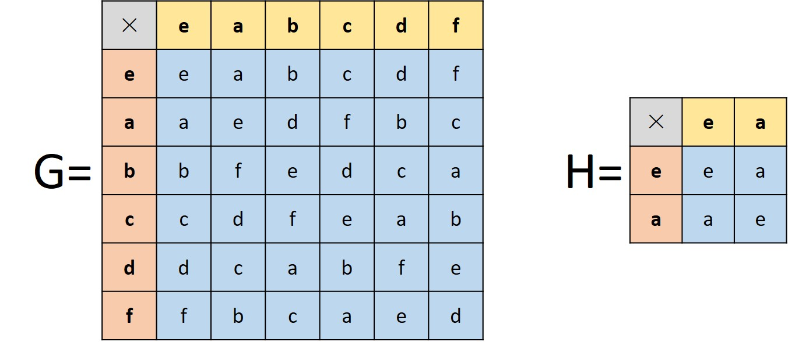

&emsp;&emsp;我们先分析 $H$ 的左陪集，$\forall \ g \in G$，有

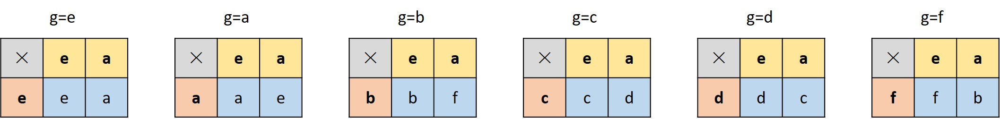

不难发现 $e \sim a$，$b \sim f$，$c \sim d$。所以 $H$ 的左陪集有3个，分别为 $(e,a)$，$(b,f)$，$(c,d)$。我们可以发现左陪集的并是 $G$，而交集为空集。每个左陪集均和 $H$ 的元素个数相同，且左陪集个数等于群 $G$ 的阶除以 $H$ 的阶。$G/H=((e,a),(b,f),(c,d))$。

&emsp;&emsp;我们再分析 $H$ 的右陪集，$\forall \ g \in G$，有

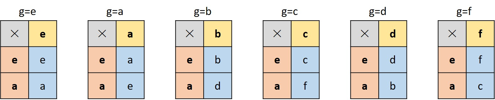

不难发现 $e \sim a$，$b \sim d$，$c \sim f$。所以 $H$ 的右陪集有3个，分别为 $(e,a)$，$(b,d)$，$(c,f)$。我们可以发现右陪集的并是 $G$，而交集为空集。每个右陪集均和 $H$ 的元素个数相同，且右陪集个数等于群 $G$ 的阶除以 $H$ 的阶。$G/H=((e,a),(b,d),(c,f))$。

&emsp;&emsp;需要注意的是虽然左陪集的元素个数等于右陪集的元素个数，但是左陪集和右陪集不一定相同哦。

**示例1.3：**

&emsp;&emsp;1. $n$ 是任意的一个正整数，$\mathbb{Z}$ （此处的二元运算为 $+$，即 $\mathbb{Z}+\mathbb{Z} \rightarrow \mathbb{Z}$）的子群 $n\mathbb{Z}$。0的陪集是集合 $\{0\}$，并且任何非零整数 $m \in \mathbb{Z}$ 的陪集是：
$$
m+n\mathbb{Z}=\{m+nk|k \in \mathbb{Z}\}
$$
&emsp;&emsp;通过用 $n$ 除 $m$，对于 $0 \leq r \leq n-1$ 存在 $r$ 满足 $m=nq+r$。同时我们会发现 $r$ 是陪集 $m+n\mathbb{Z}$ 的最小正元素。这意味着 $n\mathbb{Z}$ 的陪集与以 $n$ 为模的余数组成的集合 $\{0,1,\cdots,n-1\}$ 之间满足双射关系，或者说 $\mathbb{Z}$ 的子群 $n\mathbb{Z}$ 的陪集与 $\mathbb{Z}/n\mathbb{Z}$ 之间满足双射关系。

&emsp;&emsp;2. $SL(n,\mathbb{R})$ 是 $GL(n,\mathbb{R})$ 的子群，$SL(n,\mathbb{R})$ 的陪集是矩阵组成的集合：
$$
A \ SL(n,\mathbb{R})=\{AB \ | \ B \in SL(n,\mathbb{R})\}, \ A \in GL(n,\mathbb{R})
$$
&emsp;&emsp;由于 $A$ 可逆，所以其行列式不为零 $det(A) \neq 0$，并且当 $det(A)>0$ 时我们可以将矩阵 $A$ 写作 $A=(det(A))^{1/n}((det(A))^{-1/n}A)$，当 $det(A)<0$ 时我们可以将矩阵 $A$ 写作 $A=(-det(A))^{1/n}((-det(A))^{-1/n}A)$。但是，当 $det(A)>0$ 时 $(det(A))^{-1/n}A \in SL(n,\mathbb{R})$；当 $det(A)<0$ 时，$-(-det(A))^{-1/n}A \in SL(n,\mathbb{R})$，所以陪集 $A \ SL(n,\mathbb{R})$ 包含矩阵：
$$
若  \ det(A)>0，(det(A))^{1/n}I_n\\
若  \ det(A)<0，-(-det(A))^{1/n}I_n
$$
据此可推出 $SL(n,\mathbb{R})$ 所有陪集组成的集合（每一个陪集是其中的一个元素）与 $\mathbb{R}$ 之间具有双射关系。我们在这里对这个结论加以解释：给定的矩阵 $A$ 那么其对应的陪集必然包括元素 $(det(A))^{1/n}I_n, \ det(A)>0$ 或 $-(-det(A))^{1/n}I_n, \ det(A)<0$，若此时取 $B \in GL(n,\mathbb{R})$，满足 $det(A)=det(B)$，根据陪集间的交集为空集可知 $B$ 和 $A$ 对应的陪集为同一个陪集。所以呢，只有 $A,B \in GL(n,\mathbb{R}), \ det(A) \neq det(B)$ 时，其对应的才为不同的陪集，即行列式不同的矩阵对应的等价类不同。而 $det(A),det(B) \in \mathbb{R}$，所以不同的陪集对应不同的实数，且能取遍整个实数空间，满足一一映射。

&emsp;&emsp;3. $SO(n)$ 是 $GL^{+}(n,\mathbb{R})$ 的子群，$SO(n)$ 的陪集是矩阵组成的集合：
$$
A \ SO(n)=\{AQ \ | \ Q \in SO(n)\}，A \in GL^{+}(n,\mathbb{R})
$$
我们若将矩阵用极坐标进行表示，可以发现 $SO(n)$ 的陪集和 $n$ 阶对称正定矩阵之间满足双射关系，且这些对称矩阵的特征根均为正。

&emsp;&emsp;我们先来讨论对称矩阵的一种特殊形式：正定矩阵。<u>正定矩阵是一个对称矩阵，且所有的特征值均为正。</u>当矩阵的特征值均为非负值时，我们说该矩阵是半正定矩阵。判断一个矩阵是否为正定矩阵的方法之一是计算其所有的特征值，并检验所有特征值是否均为正。但是对于大型矩阵，计算其所有的特征值并不是一件容易的事情，所以我们需要找其他方法判断一个矩阵是否为正定矩阵。我们给出正定矩阵的另外一种定义：正定矩阵是一个对称矩阵，且其主元均为正。通常情况下，主元的计算要比计算特征值简单一些，因为主元的计算过程只需要对矩阵进行初等变换，然后对其主对角线元素进行分析。我们在这里给出一个例子加以说明：
$$
\left(
 \begin{matrix}
   1 & 2\\
   2 & 1
 \end{matrix}
\right) \Rightarrow
\left(
 \begin{matrix}
   1 & 2\\
   0 & -3
 \end{matrix}
\right)
$$

&emsp;&emsp;我们将矩阵的第一行乘-2加到了第二行，从而将矩阵变为阶梯状。故而，矩阵的主元为1和-3，由于 $-3 < 0$，所以该矩阵不为正定阵。我们还有一种方式判断矩阵是否为正定阵，我们可以取矩阵的左上角 $k \times k$ 个元素组成子方阵（顺序主子式），并计算其行列式的值，若对于所有的 $1 \leq k \leq n$，均有顺序主子式的行列式大于零，那么该矩阵为正定阵。我们在这里给出一个例子加以说明：
$$
\left(
 \begin{matrix}
   2 & -1 & 0\\
   -1 & 2 & -1\\
   0 & -1 & 2
 \end{matrix}
\right) \Rightarrow
2>0, \ \
\left|
 \begin{matrix}
   2 & -1\\
   -1 & 2
 \end{matrix}
\right|=3>0, \ \
\left|
 \begin{matrix}
   2 & -1 & 0\\
   -1 & 2 & -1\\
   0 & -1 & 2
 \end{matrix}
\right|=4>0
$$

&emsp;&emsp;因为 $2>0,3>0,4>0$，所以该矩阵为正定阵。若 $x$ 为矩阵 $A$ 的一个特征向量，且 $x \neq 0, \ Ax=\lambda x$，此时有 $x^TAx=\lambda x^T x$。若 $\lambda >0$，那么要使 $x^Tx>0$，我们必须有 $x^TAx>0$。所以，矩阵 $A$ 要想为正定阵，那么需要满足 $\forall x \neq 0, \ x^TAx>0$。我们根据此性质可以很容易证明一些结论，例如若 $A,B$ 均为正定阵，那么 $A+B$ 也为正定阵，证明过程如下
$$
\forall \ x \neq 0, \ x^T(A+B)x=x^TAx+x^TBx>0
$$

&emsp;&emsp;除了上述的判别方法之外，我们这里给出最后一种正定阵的判别方法：若矩阵 $A$ 为正定阵 $\Leftrightarrow \ A=R^TR$，其中 $R$ 为可逆阵，$x^TAx=x^TR^TRx=(Rx)^T(Rx)=\parallel Rx \parallel^2$。如果 $R$ 的列向量之间是线性无关的（即当且仅当 $k_1=k_2=\cdots=k_n=0$ 时， $k_1a_1+k_2a_2+\cdots+k_na_n=0$，我们说 $a_1,a_2,\cdots,a_n$ 之间线性无关），那么若 $x \neq 0$ 就有 $Rx \neq 0$，故而 $x^TAx>0$。

&emsp;&emsp;有了上述知识后，我们给出本例的证明。我们取 $C \in GL^+(n,\mathbb{R})$，那么其对应的陪集为 $C \ SO(n)=\{C \ Q|Q \in SO(n)\}$。若矩阵 $A,B$ 均在此陪集内，则存在 $Q_1,Q_2 \in SO(n)$ 使得 $A=CQ_1, \ B=CQ_2$。那么根据群的封闭性必然存在 $Q_3=Q_2^{-1}Q_1 \in SO(n)$，使得 $Q_1=Q_2Q_3$，故而有 $A=BQ_3$。那么 $AA^T=BQ_3(BQ_3)^T=BQ_3Q_3^TB^T$。由于 $Q_3 \in SO(n)$，所以 $Q_3$ 满足正交，即 $Q_3Q_3^T=I_n$，因为矩阵乘法满足结合律，所以 $AA^T=B(Q_3Q_3^T)B^T=BI_nB^T=BB^T$。根据两个矩阵乘积的行列式的值等于矩阵行列式的乘积，即 $det(CQ_1)=det(C)det(Q_1)$。在本例中，$C \in GL^+(n,\mathbb{R})$，所以 $det(C)>0$，而 $Q \in SO(n)$，所以 $det(Q)=1$，故而 $det(A)>0, \ det(B)>0$，根据此能知道 $A,B$ 均可逆，所以 $AA^T,BB^T$ 的计算结果为正定阵。因为正定阵的算数平方根具有唯一性，所以陪集 $C \ SO(n)$ 有唯一正定表示 $\sqrt{AA^T}$。

&emsp;&emsp;我们接下来对上述证明过程中用到的一些结论加以说明。首先我们讨论为什么对于任意的两个 $n \times n$ 矩阵 $A,B$ （注意，此处的矩阵不能为仅由一个元素组成的标量），有 $det(AB)=det(A)det(B)$。我们先来讨论 $det(A)=0$ 的情况，此时矩阵 $A$ 不可逆，那么 $AB$ 的计算结果也不可逆（若 $A$ 不可逆，那么其秩小于其阶数，即通过初等行变换 $A$ 中可以出现全零行，此时该矩阵与任意矩阵进行相乘均会出现全零行，所以其乘积的结果亦不可逆，需要注意的是一个矩阵经过初等行变换后得到的结果和原始的矩阵是等价的），即 $det(AB)=0$，故而 $det(AB)=det(A)det(B)$。我们再来讨论 $det(A) \neq 0$ 的情况，此时矩阵 $A$ 可逆，那么 $A$ 经过初等行变换可以变为单位阵 $I_n$，故而矩阵 $A$ 可以写作 $A=E_1E_2 \cdots E_k$，其中 $E_k$ 为初等矩阵（初等矩阵是指由单位矩阵经过一次初等变换得到的矩阵，行互换会使行列式变号，某行扩大 $k$ 倍会使行列式变 $k$ 倍，某行乘 $k$ 倍加到另外一行，行列式不变），即 $A$ 可以表示为有限个初等矩阵的乘积，那么 $AB=E_1E_2 \cdots E_kB$。鉴于对任意初等矩阵 $E$，我们都有 $det(EB)=det(E)det(B)$，那么有如下计算过程：
$$
det(A)=det(AI_n)=det(E_1E_2 \cdots E_kI_n)\\
=det(E_1)det(E_2 \cdots E_kI_n)\\
\vdots\\
=det(E_1)det(E_2)\cdots det(E_k)1
$$

***

$$
det(AB)=det(E_1E_2 \cdots E_kB)\\
=det(E_1)det(E_2\cdots E_kB)\\
\vdots\\
=det(E_1)det(E_2)\cdots det(E_k)det(B)
$$

***

$$
det(AB)=det(A)det(B)
$$

&emsp;&emsp;综上所述，我们便得到两个矩阵乘积的行列式的值等于矩阵行列式的乘积。

&emsp;&emsp;4. 群 $SO(2)$ 是群 $SO(3)$ 的稳定子群，$SO(2)$ 的陪集是由矩阵组成的集合：
$$
Q \ SO(2)=\{QR \ | \ R \in SO(2)\}，Q \in SO(3)
$$
群 $SO(3)$ 的作用我们可以表述为将球体 $R^3$ 表面 $S^2$ 上的一点 $x \in S^2$ 进行旋转，旋转过程满足 $\forall  \ Q \in SO(3), \ x \rightarrow Qx$，其中 $S^2=\{(x,y,z) \in R^3 \ | \ x^2+y^2+z^2=1\}$。我们用 $N=(0,0,1)$ 表示球体 $S^2$ 的北极点，不难发现，当 $N$ 固定时，$SO(2)$ 恰好是 $SO(3)$ 的稳定子群。这导致陪集 $Q \ SO(2)$ 的所有的旋转 $Q \ R$ 都将点 $N$ 映射到点 $Q \ N \in S^2$ ，并且可以发现 $SO(2)$ 的陪集与 $S^2$ 上的点满足双射关系。此映射关系满足满射与 $SO(3)$ 对 $S^2$ 的作用满足传递性有关。$\forall \ x \in S^2$，均有旋转矩阵 $Q \in SO(3)$，使得 $QN=x$。这部分内容涉及李群和李代数的相关知识。具体内容见书《Lie Groups, Physis, and Geometry》。可参考的连接有[1](https://math.stackexchange.com/questions/1177583/quotient-spaces-so3-so2-and-so3-o2)、[2](https://math.stackexchange.com/questions/1219453/how-can-we-prove-that-so2-is-a-subgroup-of-so3)、[3](https://math.stackexchange.com/questions/3575637/cosets-of-so2-in-so3)。我们给出上述旋转过程的图解说明：

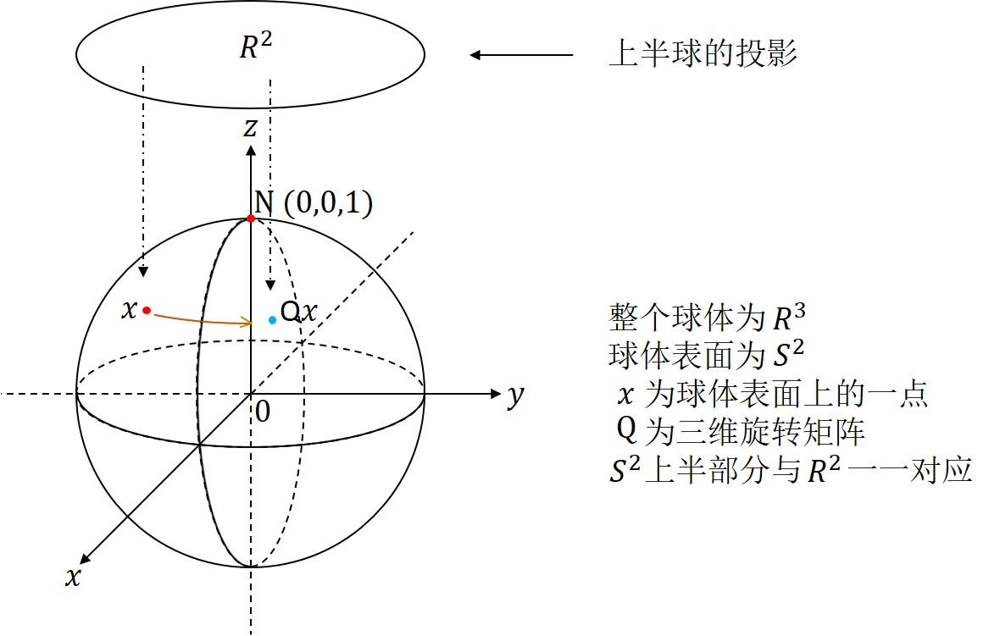

图1.6 二维旋转到三维旋转的映射

&emsp;&emsp;我们对这里矩阵相乘的过程进行说明：由于 $SO(2)$ 的元素为2阶矩阵，$SO(3)$ 的元素为3阶矩阵，所以其不能直接相乘。此时，我们需要对 $SO(2)$ 中的矩阵扩维至3阶，扩维方法遵循如下约定：$\forall \ R=\left(
 \begin{matrix}
   a & b\\
   c & d
 \end{matrix}
\right) \in SO(2)$ 可以将其变换为：
$$
R=
\left(
 \begin{matrix}
   a & b & 0\\
   c & d & 0\\
   0 & 0 & 1
 \end{matrix}
\right)
$$

&emsp;&emsp;不难发现此时的 $SO(2)$ 是 $SO(3)$ 的子群，并且与扩维前的 $SO(2)$ 是同构的。

&emsp;&emsp;通过下式我们可以定义左陪集（或者右陪集）之间的乘积运算：
$$
(g_1H)(g_2H)=(g_1g_2)H
$$
但是这个运算性质并不是普遍存在的，除非子群 $H$ 拥有特殊的性质才成立。在示例1.3中，可以对例1进行陪集间的乘积运算，但是对例2，3中的陪集并不能做乘积运算。那么哪些陪集可以做乘积运算呢？若子群 $H$ 的核满足同态，那么其左陪集可以进行乘积运算，我们在这里给出同态的定义。

**定义1.7：** 给定两个任意的群 $G$ 和 $G'$，我们定义映射关系 $\varphi$，使得 $G \rightarrow G'$ 是同态 $\Leftrightarrow$ $\forall \ g_1,g_2 \in G, \ \varphi(g_1g_2)=\varphi(g_1)\varphi(g_2)$。当 $g_1=g_2=e \in G$ 时，我们可以发现 $\varphi(e)=e'$，当 $g_1=g,g_2=g^{-1}$ 时，我们可以发现 $\varphi(g^{-1})=(\varphi(g))^{-1}$。

**示例1.4：**

&emsp;&emsp;1. 映射 $\varphi:\mathbb{Z} \rightarrow \mathbb{Z}/n\mathbb{Z}$，其中 $\forall \ m \in \mathbb{Z}, \ \varphi(m)=m \ mod \ n$ 是一个同态。

&emsp;&emsp;2. 映射 $det:GL(n,\mathbb{R}) \rightarrow \mathbb{R}$ 是一个同态，因为 $\forall \ A,B \in GL(n,\mathbb{R}),det(AB)=det(A)det(B)$。同样的映射 $det:O(n) \rightarrow \mathbb{R}$ 也是一个同态。

&emsp;&emsp;如果 $\varphi:G \rightarrow G'$ 和 $\psi:G' \rightarrow G''$ 是群同态，那么 $\psi \circ \varphi:G \rightarrow G''$ 也是一个同态。如果 $\varphi:G \rightarrow G'$ 是群的同态，并且 $H \subseteq G,H' \subseteq G'$ 是两个子群，那么有 $\text{Im} \ H=\varphi(H)=\{\varphi(g) \ | \ g \in H\}$ 是 $G'$ 的子群，并且 $\varphi^{-1}(H')=\{g \in G \ | \ \varphi(g) \in H'\}$ 是 $G$ 的子群。特殊的，当 $H'=\{e'\}$ 时，计算结果为 $\varphi$ 的核，记作 $\text{Ker} \ \varphi$。

**定义1.8：** 若映射 $\varphi:G \rightarrow G'$ 是群的同态，且 $H \subseteq G$ 是 $G$ 的一个子群，那么 $G'$ 的子群可由下式计算 $\text{Im} \ H=\varphi(H)=\{\varphi(g) \ | \  g \in H\}$，其中 $\text{Im} \ H$ 称作 $H$ 在 $\varphi$ 之下的象，同时也是 $G'$ 的子群。$\text{Ker} \ \varphi=\{g \in G \ | \ \varphi(g)=e'\}$ 称作 $\varphi$ 的核。

**示例1.5：**

&emsp;&emsp;1. 同态 $\varphi:\mathbb{Z} \rightarrow \mathbb{Z}/n\mathbb{Z}$ 的核是 $n\mathbb{Z}$，因为对所有能被整除的项取余的计算结果均为0。

&emsp;&emsp;2. 同态 $det:GL(n,\mathbb{R}) \rightarrow \mathbb{R}$ 的核是 $SL(n,\mathbb{R})$ （其行列式为1），同样的，同态 $det:O(n) \rightarrow \mathbb{R}$ 的核是 $SO(n)$ （其行列式为1）。

&emsp;&emsp;我们将经常对满足单射的群的同态进行分析。

**命题1.8：** 如果映射 $\varphi:G \rightarrow G'$ 是群的同态，那么 $\varphi:G \rightarrow G'$ 是一个单射  $\Leftrightarrow$ $\text{Ker} \ \varphi=\{e\}$ （我们也可以写作 $\text{Ker} \ \varphi=(0)$）。

&emsp;&emsp;证明：假设 $\varphi$ 满足单射。若 $\varphi(e)=e'$， $\varphi(g)=e'$，则 $\varphi(g)=\varphi(e)$。因为 $\varphi$ 满足单射，所以 $g=e$，所以 $\text{Ker} \ \varphi=\{e\}$。相反的，假定 $\text{Ker} \ \varphi=\{e\}$，若 $\varphi(g_1)=\varphi(g_2)$，那么等式两端同乘 $(\varphi(g_1))^{-1}$，我们有 $e'=(\varphi(g_1))^{-1}\varphi(g_1)=(\varphi(g_1))^{-1}\varphi(g_2)$，由于 $\varphi$ 是一个同态，所以 $\varphi(g_1^{-1}g_1)=\varphi(e)=e'=\varphi(g_1^{-1})\varphi(g_1) \Rightarrow (\varphi(g_1))^{-1}=\varphi(g_1^{-1})$，所以
$$
e'=(\varphi(g_1))^{-1}\varphi(g_2)=\varphi(g_1^{-1})\varphi(g_2)=\varphi(g_1^{-1}g_2)
$$
上式表明 $g_1^{-1}g_2 \in \text{Ker} \ \varphi$，但由于 $\text{Ker} \ \varphi=\{e\}$ 所以我们有 $g_1^{-1}g_2=e$，故而 $g_2=g_1$，验证了 $\varphi$ 满足单射。

**定义1.9：** 若存在同态 $\psi:G' \rightarrow G$，我们说群的同态 $\varphi:G \rightarrow G'$ 是一个同构。也就是说
$$
\psi \circ \varphi=id_G \ \ 并且  \ \ \varphi \circ \psi=id_{G'}\ \ \ \ \ \ \ \ \  (\sharp)
$$
如果 $\varphi$ 是同构我们说群 $G$ 与 $G'$ 是同构的。当 $G'=G$ ，我们便将其称之为自同构。

&emsp;&emsp;命题1.2的证明过程显示了如果一个群同态 $\varphi:G \rightarrow G'$ 是一个同构，那么存在唯一的同态 $\psi:G' \rightarrow G$ 满足条件 $\sharp$。这个同态被记为 $\varphi^{-1}$。

&emsp;&emsp;左平移 $L_g$ 和右平移 $R_g$ 是 $G$ 的自同构。

&emsp;&emsp;假设 $\varphi:G \rightarrow G'$ 是一个**双射同态**，并且 $\varphi^{-1}$ 是 $\varphi$ 的逆映射，那我们对于 $\forall \ a,b \in G'$，都有
$$
\varphi(\varphi^{-1}(a)\varphi^{-1}(b))=\varphi(\varphi^{-1}(a))\varphi(\varphi^{-1}(b))=ab\\
且 \ \ \varphi(\varphi^{-1}(ab))=ab\\
\varphi^{-1}(ab)=\varphi^{-1}(a)\varphi^{-1}(b)
$$
这证明了 $\varphi^{-1}$ 是一个同态，因此我们给出下述结论。

**命题1.9：** 双射群的同态 $\varphi:G \rightarrow G'$ 是一个同构。

&emsp;&emsp;我们先对性质 $(\ast)\ \ \ \forall \ g \in G,\ gH=Hg$ 进行分析，在等式两端同时乘 $g^{-1}$，便有 $\forall \ g \in G,\ gHg^{-1}=H$，并且呢 $(\ast\ast)\ \ \ \forall \ g \in G,\ gHg^{-1} \subseteq G$。这是因为 $\forall \ g \in G,\ gHg^{-1} \subseteq H$ 意味着 $H \subseteq g^{-1}Hg$。

&emsp;&emsp;若 $H$ 是 $G$ 的正规子群，那我们有如下5种等价的判别方法，即 $H$ 是 $G$ 的正规子群 $\Leftrightarrow (1) \Leftrightarrow (2) \Leftrightarrow (3) \Leftrightarrow (4) \Leftrightarrow (5)$。

> (1) $\forall \ g \in G, \ h \in H$，我们有 $ghg^{-1} \in H$。 
> (2) $\forall \ g \in G, \ gHg^{-1} \subseteq H$。 
> (3) $\forall \ g \in G, \ gH=Hg$。 
> (4) $H$ 的每一个右陪集都是一个左陪集。 
> (5) $H$ 是 $G$ 到其他群同态映射的核。

&emsp;&emsp;我们先来证明(4) $\Rightarrow$ (3)。取 $g \in G$，由于 $H$ 的每一个右陪集都是一个左陪集，那么就存在 $b \in G$ 使得 $Hg=bH$。由于群 $H$ 包含单位元 $e$，所以 $g \in Hg=bH$，故而可知 $b^{-1}g \in H$，根据群中的每一个元素都有逆元，且逆元也为群的元素，我们知 $(b^{-1}g)^{-1}=g^{-1}b \in H$。根据上述内容可推出(3)：
$$
Hg=(gg^{-1})(bH)=g((g^{-1}b)H)=gH
$$

&emsp;&emsp;从现在开始，我们便有 $\forall \ g \in G, \ gH=Hg$。现在我们来证明(4) $\Rightarrow$ (5)。若 $aH \neq bH$，那么 $aH \cap bH = \emptyset$。若 $aH \cap bH \neq \emptyset$，那么 $aH=bH$。特别的，我们有 $b \in aH \Rightarrow aH=bH$。所以我们取 $g \in aH \cap bH$，例如 $k \in H, \ g=ak$，$l \in H, \ g=bl$。那么我们有 $\forall \ h \in H, \ ah=blk^{-1}h \in bH$，所以 $aH \subseteq bH$。同样可知 $bH \subseteq aH$，故而他们之间满足等价关系。

&emsp;&emsp;群 $G$ 是子群 $H$ 所有左陪集的不相交并集（所有右陪集的不相交并集）。因为 $\forall \ a \in G$ 是左陪集 $aH$ 的元素（也是右陪集 $Ha$ 的元素），$G$ 是所有左陪集的并集（也是所有右陪集的并集），根据我们之前的知识知道，左陪集之间是不相交的（右陪集之间也是不相交的）。我们接下来证明(5)。首先给出结论：若 $G$ 表示一个群，$H$ 是群 $G$ 的正规子群，那么 $G/H=\{aH|a \in G\}$ 是一个群且满足等式 $aH \times bH = abH$，且存在映射 $\varphi:G \rightarrow G/H, \ a \mapsto aH$，映射 $\varphi$ 为同态满射，其核 $\text{Ker}(\varphi)=H$。

&emsp;&emsp;证明：首先我们分析乘法部分，例如 $\forall \ a,a',b,b' \in G$ 当满足 $aH=a'H, \ bH=b'H$ 时有 $abH=a'b'H$。我们取 $h,k \in H$，使其满足 $a'=ah, \ b'=bk$。由于 $H$ 是 $G$ 的正规子群，那么存在 $h' \in H$ 使得 $hb=bh'$，那么有
$$
a'b'H=ahbkH=abh'kH=abH
$$

根据乘法的结合律，那么对于 $\forall \ aH,bH,cH \in G/H$ 就有如下计算过程：
$$
(aH \times bH) \times cH=abH \times cH=abc \times H=aH \times (bcH)=aH \times (bH \times cH)
$$

其中 $eH=H \in G/H$ 是单位元，因为对于 $\forall \ aH \in G/H$ 有：
$$
eH \times aH=eaH=aH=aeH=aH \times eH
$$

对于 $\forall \ aH \in G/H$ 都存在逆元 $a^{-1}H \in G$，证明如下：
$$
aH \times a^{-1}H=aa^{-1}H=eH=H=eH=a^{-1}aH=a^{-1}H \times aH
$$

所以我们证明了 $G/H$ 是一个群。接下来证明 $\varphi$ 是群同态，对于 $\forall \ a,b \in G$ 满足 $\varphi(a)=aH$ 所以我们有：
$$
\varphi(ab)=abH=aH \times bH=\varphi(a)\varphi(b)
$$

显然 $\varphi$ 是满射的。我们接下来证明 $\text{Ker}(\varphi)=H$，证明过程如下：
$$
a \in \text{Ker}(\varphi) \Leftrightarrow \varphi(a)=eH \Leftrightarrow aH=eH \Leftrightarrow a \in H
$$

备注：$G/H$ 称作商群。最后呢，我们来证明(5) $\Rightarrow$ (1)。首先给出结论：我们有群 $G,G'$，现有映射 $\varphi:G \rightarrow G'$ 是群同态。定义 $H=\text{Ker}(\varphi)$，那么有 $\forall \ g \in G,h \in H, \ ghg^{-1} \in H$。

&emsp;&emsp;证明：我们取 $h \in H, \ gh \in gH$ 那么有
$$
\varphi(ghg^{-1})=\varphi(g)\varphi(h)\varphi(g^{-1})=\varphi(g)\varphi(g^{-1})=e_{G'}
$$

所以 $ghg^{-1} \in H$。以上内容参考自[Mathematics](https://math.stackexchange.com/questions/3043931/equivalent-definitions-of-normal-subgroups)。

**命题1.10：** 令 $\varphi:G \rightarrow G'$ 是一个群同态，那么 $H=\text{Ker} \ \varphi$ 满足性质($\ast$)和($\ast\ast$)。

&emsp;&emsp;证明：我们有
$$
\varphi(ghg^{-1})=\varphi(g)\varphi(h)\varphi(g^{-1})=\varphi(g)e'\varphi(g)^{-1}=\varphi(g)\varphi(g)^{-1}=e'
$$
$\forall \ g \in G, \ \forall \ h \in H=\text{Ker} \ \varphi$。所以，通过定义 $H=\text{Ker} \ \varphi$，我们有 $gHg^{-1} \subseteq H$。

**定义1.10：** 对于任意的群 $G$，其子群 $N$ 是 $G$ 的正规子群 $\Leftrightarrow \forall \ g \in G, \ gNg^{-1}=N$，我们将其记为 $N \vartriangleleft G$。

&emsp;&emsp;命题1.10指出同态 $\varphi:G \rightarrow G'$ 的核 $\text{Ker} \ \varphi$ 是 $G$ 的正规子群。我们注意到，若 $G$ 是一个阿贝尔群（满足交换律），那么 $G$ 的任意一个子群都是正规的。我们回顾一下例1.2，令 $R \in SO(2), \ A \in SL(2,\mathbb{R})$，即：
$$
R=
\left(
 \begin{matrix}
   0 & -1\\
   1 & 0
 \end{matrix}
\right), \ \
A=
\left(
 \begin{matrix}
   1 & 1\\
   0 & 1
 \end{matrix}
\right)
$$

我们不难发现：
$$
A^{-1}=
\left(
 \begin{matrix}
   1 & -1\\
   0 & 1
 \end{matrix}
\right)
$$

我们可以得到如下计算结果：
$$
ARA^{-1}=
\left(
 \begin{matrix}
   1 & 1\\
   0 & 1
 \end{matrix}
\right)
\left(
 \begin{matrix}
   0 & -1\\
   1 & 0
 \end{matrix}
\right)
\left(
 \begin{matrix}
   1 & -1\\
   0 & 1
 \end{matrix}
\right)=
\left(
 \begin{matrix}
   1 & -1\\
   1 & 0
 \end{matrix}
\right)
\left(
 \begin{matrix}
   1 & -1\\
   0 & 1
 \end{matrix}
\right)=
\left(
 \begin{matrix}
   1 & -2\\
   1 & -1
 \end{matrix}
\right)
$$

显然 $ARA^{-1} \notin SO(2)$，那么 $SO(2)$ 不是 $SL(2,\mathbb{R})$ 的正规子群。我们同样可以举反例证明 $O(2)$ 不是 $GL(2,\mathbb{R})$ 的正规子群。

&emsp;&emsp;令 $R \in SO(2), \ Q \in SO(3)$，这里2阶到3阶的变换参见示例1.3的4：
$$
R=
\left(
 \begin{matrix}
   0 & -1 & 0\\
   1 & 0 & 0\\
   0 & 0 & 1
 \end{matrix}
\right),  \ \
Q=
\left(
 \begin{matrix}
   1 & 0 & 0\\
   0 & 0 & -1\\
   0 & 1 & 0
 \end{matrix}
\right)
$$

那么有：
$$
Q^{-1}=Q^T=\frac{Q^*}{|Q|}=
\left(
 \begin{matrix}
   1 & 0 & 0\\
   0 & 0 & 1\\
   0 & -1 & 0
 \end{matrix}
\right)
$$

并且我们有如下计算结果：
$$
QRQ^{-1}=
\left(
 \begin{matrix}
   1 & 0 & 0\\
   0 & 0 & -1\\
   0 & 1 & 0
 \end{matrix}
\right)
\left(
 \begin{matrix}
   0 & -1 & 0\\
   1 & 0 & 0\\
   0 & 0 & 1
 \end{matrix}
\right)
\left(
 \begin{matrix}
   1 & 0 & 0\\
   0 & 0 & 1\\
   0 & -1 & 0
 \end{matrix}
\right)\\=
\left(
 \begin{matrix}
   0 & -1 & 0\\
   0 & 0 & -1\\
   1 & 0 & 0
 \end{matrix}
\right)
\left(
 \begin{matrix}
   1 & 0 & 0\\
   0 & 0 & 1\\
   0 & -1 & 0
 \end{matrix}
\right)=
\left(
 \begin{matrix}
   0 & 0 & -1\\
   0 & 1 & 0\\
   1 & 0 & 0
 \end{matrix}
\right)
$$

显然 $QRQ^{-1} \notin SO(2)$，所以 $SO(2)$ 不是 $SO(3)$ 的正规子群。

&emsp;&emsp;我们取 $T,A \in GL(2,\mathbb{R})$，具体的取值结果如下：
$$
T=
\left(
 \begin{matrix}
   1 & 1\\
   0 & 1
 \end{matrix}
\right), \ \
A=
\left(
 \begin{matrix}
   0 & 1\\
   1 & 0
 \end{matrix}
\right)
$$

我们有：
$$
A^{-1}=
\left(
 \begin{matrix}
   0 & 1\\
   1 & 0
 \end{matrix}
\right)=A
$$

并且呢
$$
ATA^{-1}=
\left(
 \begin{matrix}
   0 & 1\\
   1 & 0
 \end{matrix}
\right)
\left(
 \begin{matrix}
   1 & 1\\
   0 & 1
 \end{matrix}
\right)
\left(
 \begin{matrix}
   0 & 1\\
   1 & 0
 \end{matrix}
\right)=
\left(
 \begin{matrix}
   0 & 1\\
   1 & 1
 \end{matrix}
\right)
\left(
 \begin{matrix}
   0 & 1\\
   1 & 0
 \end{matrix}
\right)=
\left(
 \begin{matrix}
   1 & 0\\
   1 & 1
 \end{matrix}
\right)
$$

矩阵 $T$ 为上三角矩阵，但是 $ATA^{-1}$ 不是上三角矩阵，所以由2阶上三角矩阵组成的群不是 $GL(2,\mathbb{R})$ 的正规子群。

&emsp;&emsp;我们取 $Q \in V$ （$V$ 表示[克莱因四元群](#克莱因四元群)）以及 $A \in GL(2,\mathbb{R})$，具体的取值结果如下：
$$
Q=
\left(
 \begin{matrix}
   1 & 0\\
   0 & -1
 \end{matrix}
\right), \ \
A=
\left(
 \begin{matrix}
   1 & 1\\
   0 & 1
 \end{matrix}
\right)
$$

我们有：
$$
A^{-1}=
\left(
 \begin{matrix}
   1 & -1\\
   0 & 1
 \end{matrix}
\right)
$$

故而：
$$
AQA^{-1}=
\left(
 \begin{matrix}
   1 & 1\\
   0 & 1
 \end{matrix}
\right)
\left(
 \begin{matrix}
   1 & 0\\
   0 & -1
 \end{matrix}
\right)
\left(
 \begin{matrix}
   1 & -1\\
   0 & 1
 \end{matrix}
\right)=
\left(
 \begin{matrix}
   1 & -1\\
   0 & -1
 \end{matrix}
\right)
\left(
 \begin{matrix}
   1 & -1\\
   0 & 1
 \end{matrix}
\right)=
\left(
 \begin{matrix}
   1 & -2\\
   0 & -1
 \end{matrix}
\right)
$$

显然 $AQA^{-1} \notin V$，这表明克莱因四元群不是 $GL(2,\mathbb{R})$ 的正规子群。

&emsp;&emsp;我们取 $Q \in SO(2,\mathbb{R})$ 以及 $A \in O(2,\mathbb{R})$，具体的取值结果如下：
$$
Q=
\left(
 \begin{matrix}
   \frac{\sqrt{3}}{2} & -\frac{1}{2}\\
   \frac{1}{2} & \frac{\sqrt{3}}{2}
 \end{matrix}
\right), \ \
A=
\left(
 \begin{matrix}
   0 & -1\\
   1 & 0
 \end{matrix}
\right)
$$

我们有：
$$
A^{-1}=
\left(
 \begin{matrix}
   0 & 1\\
   -1 & 0
 \end{matrix}
\right)
$$

故而：
$$
AQA^{-1}=
\left(
 \begin{matrix}
   0 & -1\\
   1 & 0
 \end{matrix}
\right)
\left(
 \begin{matrix}
   \frac{\sqrt{3}}{2} & -\frac{1}{2}\\
   \frac{1}{2} & \frac{\sqrt{3}}{2}
 \end{matrix}
\right)
\left(
 \begin{matrix}
   0 & 1\\
   -1 & 0
 \end{matrix}
\right)=
\left(
 \begin{matrix}
   -\frac{1}{2} & -\frac{\sqrt{3}}{2}\\
   \frac{\sqrt{3}}{2} & -\frac{1}{2}
 \end{matrix}
\right)
\left(
 \begin{matrix}
   0 & 1\\
   -1 & 0
 \end{matrix}
\right)\\=
\left(
 \begin{matrix}
   \frac{\sqrt{3}}{2} & -\frac{1}{2}\\
   \frac{1}{2} & \frac{\sqrt{3}}{2}
 \end{matrix}
\right)
$$

显然 $AQA^{-1} \in SO(2,\mathbb{R})$ 这表明 $SO(2,\mathbb{R})$ 是 $O(2,\mathbb{R})$ 的正规子群。我们这里给出结论：$\mathbb{Z}$ 的子群 $n\mathbb{Z}$，$GL(n,\mathbb{R})$ 的子群 $GL^{+}(n,\mathbb{R})$，$GL(n,\mathbb{R})$ 的子群 $SL(n,\mathbb{R})$ 以及 $O(n,\mathbb{R})$ 的子群 $SO(n,\mathbb{R})$ 均为正规子群。需特别注意的是 $n\mathbb{Z}$ 是很多群的子群，若 $n$ 为合数，即 $n=rs$ 其中 $r,s \neq 1 \ 且 \ r,s \neq n$，此时 $n\mathbb{Z}$ 是 $r\mathbb{Z}$ 的子群；$n\mathbb{Z}$ 是有理数组成群的子群；$n\mathbb{Z}$ 是整系数多项式组成群的子群。

&emsp;&emsp;若 $N$ 为 $G$ 的正规子群，那么由 $N$ 的左陪集导出的等价关系（详见定义1.5）和右陪集导出的等价关系是相同的。除此之外呢，这里的等价关系是全等的，这意味着 $\forall \ g_1,g_2,g_1',g_2' \in G$，我们都有：
> (1) 若 $g_1N=g_1'N$ 且 $g_2N=g_2'N$，那么 $g_1g_2N=g_1'g_2'N$。 
> (2) 若 $g_1N=g_2N$，那么 $g_1^{-1}N=g_2^{-1}N$。（这里可由单位元得出）

&emsp;&emsp;最终，通过等式 $(g_1N)(g_2N)=(g_1g_2)N$ 我们可以定义集合 $G/ \sim$ 上的群结构，其中 $G/ \sim$ 表示 $G$ 对 $\sim$ 取模后等价类组成的集合。

**定义1.11：** $G$ 表示一个群，$N$ 表示 $G$ 的正规子群。通过按下式定义左陪集的乘积可以得到一个群：
$$
(g_1N)(g_2N)=(g_1g_2)N, \ \ g_1,g_2 \in G
$$

我们将上述公式的计算结果记为 $G/N$，将其称之为 $G$ 除以 $N$ 的商。元素 $g \in G$ 的等价类 $gN$ 记作 $\overline{g}$（或者记作 $[g]$）。映射 $\pi: \ G \rightarrow G/N$ 是群同态，若同时满足下式便称作正交投影，其计算方式如下：
$$
\pi(g)=\overline{g}=gN
$$

&emsp;&emsp;由于同态的核是一个正规子群，我们可以得到如下这些很有用的结论。

**命题1.11：** 给定一个群的同态 $\varphi: \ G \rightarrow G'$，那么群 $G/\text{Ker} \ \varphi$ 与 $\text{Im} \ \varphi=\varphi(G)$ 之间是同构的。

&emsp;&emsp;证明：由于 $\varphi$ 是满射的，所以 $G'=\text{Im} \  \varphi$，我们定义映射 $\overline{\varphi}: G/ \ \text{Ker} \  \varphi \rightarrow G'$ 满足：
$$
\overline{\varphi}(\overline{g})=\varphi(g), \ \ g \in G
$$

&emsp;&emsp;我们需要检验这个映射的定义不是只对特定的陪集 $\overline{g}=g \ \text{Ker} \ \varphi$ 才有效，并且需要检验它满足同态。若 $g'$ 是陪集 $g \ \text{Ker} \ \varphi$ 中区别于 $g$ 的一个元素，这意味着 $\exists \ h \in \text{Ker} \ \varphi, \ g'=gh$，且当 $h \in \text{Ker} \ \varphi$ 时，$\varphi(h)=e'$。那么我们有：
$$
\varphi(g')=\varphi(gh)=\varphi(g)\varphi(h)=\varphi(g)e'=\varphi(g)
$$

&emsp;&emsp;根据上式可知同一陪集中任意的两个元素通过 $\varphi$ 进行映射能够得到相同的象，所以：
$$
\overline{\varphi}(\overline{g'})=\varphi(g')=\varphi(g)=\overline{\varphi}(\overline{g})
$$

&emsp;&emsp;所以映射 $\overline{\varphi}$ 是有效的。它满足同态是因为：
$$
\overline{\varphi}(\overline{g}\overline{g'}) \overset{正规}{=} \overline{\varphi}(\overline{gg'})=\varphi(gg')=\varphi(g)\varphi(g')=\overline{\varphi}(\overline{g})\overline{\varphi}(\overline{g'})
$$

&emsp;&emsp;映射 $\overline{\varphi}$ 满足单射是因为 $\overline{\varphi}(\overline{g})=e' \Leftrightarrow \varphi(g)=e' \Leftrightarrow g \in \text{Ker} \ \varphi \Leftrightarrow \overline{g}=\overline{e}$。映射 $\overline{\varphi}$ 满足满射是因为 $\varphi$ 满足满射。因此 $\overline{\varphi}$ 是一个双射同态，因此是同构。

&emsp;&emsp;另一种证明方法：我们有映射 $f: \ G/\text{Ker} \ \varphi \rightarrow \text{Im}(\varphi)$，此映射是 $gK$ 到 $\varphi(g)$ 的映射，其中 $K=\text{Ker} \ \varphi$。由前面的知识可知 $K$ 为正规子群。首先我们假设 $a,b \in G \ 且 \ aK=bK$，我们在等式两端同时左乘 $b^{-1}$，即 $b^{-1}aK=K$。在 $b^{-1}aK$ 中我们可取 $e \in K$，此时可推出 $b^{-1}a \in K$。所以有：
$$
\varphi(b^{-1}a)=e'
$$

同时呢我们根据 $\varphi(e)=e'$ 且 $\varphi$ 为同态映射，所以有 $\varphi(bb^{-1})=\varphi(b)\varphi(b^{-1})=e'$，故而有 $(\varphi(b))^{-1}=\varphi(b^{-1})$。鉴于此我们有：
$$
\varphi(b^{-1}a)=(\varphi(b))^{-1}\varphi(a)=e'
$$

那么我们有 $\varphi(a)=\varphi(b)$，同时由于 $aK=bK$ 所以 $f(aK)=f(bK)$，显然 $f$ 满足满射。我们接下来证明 $f$ 满足单射：若 $f(aK)=f(bK)$，那么 $a,b$ 通过作用方式 $\varphi$ 映射到 $\text{Im}(\varphi)$ 中的同一个元素。映射 $\varphi$ 满足同态映射，那么对于
$$
f(aK)=f(bK) \Rightarrow \varphi(a)=\varphi(b) \Rightarrow e'=\varphi^{-1}(a)\varphi(b)=\varphi(a^{-1})\varphi(b)=\varphi(a^{-1}b)\\
\Rightarrow a^{-1}b \in K \Rightarrow aK=bK
$$

这说明唯有相同的自变量才能得到相同的象，所以映射 $f$ 满足单射。由于有
$$
f(aKbK) \overset{正规}{=} f(abK) \overset{映射}{=} \varphi(ab) \overset{同态}{=} \varphi(a)\varphi(b) \overset{映射}{=} f(aK)f(bK)
$$

所以 $f$ 满足同构。

&emsp;&emsp;命题1.11被称为 第一同构定理 。我们在这里给出本命题的图解表述：

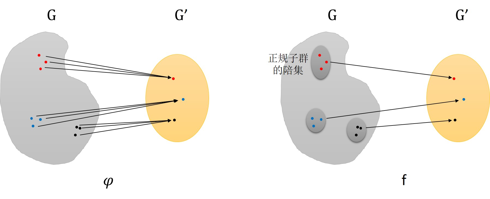

接下来我们将介绍一种有效的构造群的方法：直积构造。

**定义1.12：** 给定两个群 $G$ 和 $H$，我们令 $G \times H$ 表示先对集合 $G$ 与集合 $H$ 计算笛卡尔积，然后对笛卡尔积的运算结果做乘法运算 $\cdot$ 得到 $G$ 和 $H$ 的直积，其计算过程如下：
$$
(g_1, \ h_1) \cdot (g_2, \ h_2)=(g_1g_2, \ h_1h_2)
$$

&emsp;&emsp;不难验证 $G \times H$ 的计算结果是一个群。我们这里给出具体的证明过程：

**待证结论：** 给定正整数 $n \geq 1$，假定 $\{G_1, \cdots, G_n\}$ 是由群构成的有限集合。定义集合 $G=G_1 \times G_2 \times \cdots \times G_n$ 的计算方式为：由元素 $g_i \in G_i$ 构成的有序 $n$ 元组 $(g_1, g_2, \cdots, g_n)$。通过下式定义的乘积运算 $\bullet: \ G \times G \rightarrow G$ 能够使得 $G$ 是一个群：
$$
(g_1, g_2, \cdots, g_n) \bullet (g_1', g_2', \cdots, g_n')=(g_1g_1', g_2g_2', \cdots, g_ng_n')
$$

**[证明过程](https://math.stackexchange.com/questions/1162848/proving-a-direct-product-of-groups-is-a-group/3049114#comment2370733_1162848)：**
1. **封闭性：** 因为 $(g_1, g_2, \cdots, g_n) \bullet (g_1', g_2', \cdots, g_n')=(g_1g_1', g_2g_2', \cdots, g_ng_n')$，又因为每一个 $G_i$ 都是一个群，所以根据群的封闭性可知 $g_ig_i' \in G_i$，故而 $G$ 满足封闭性。
2. **结合律：** $((g_1, g_2, \cdots, g_n) \bullet (g_1', g_2', \cdots, g_n')) \bullet (g_1'', g_2'', \cdots, g_n'')=(g_1g_1', g_2g_2', \cdots, g_ng_n') \bullet$   $(g_1'', g_2'', \cdots, g_n'')=((g_1g_1')g_1'', (g_2g_2')g_2'', \cdots, (g_ng_n')g_n'')=$   $(g_1(g_1'g_1''), g_2(g_2'g_2''), \cdots, g_n(g_n'g_n''))=(g_1, g_2, \cdots, g_n) \bullet (g_1'g_1'', g_2'g_2'', \cdots, g_n'g_n'')=$   $(g_1, g_2, \cdots, g_n) \bullet ((g_1', g_2', \cdots, g_n') \bullet (g_1'', g_2'', \cdots, g_n''))$
3. **单位元：** 对于每一个群 $G_i$ 都存在单位元，我们将其单位元记为 $e_i$。$G$ 中元素与单位元的乘积如下式：
$$
(g_1, g_2, \cdots, g_n) \bullet (e_1, e_2, \cdots, e_n)=(g_1, g_2, \cdots, g_n)
$$

4. **逆元素：** 由于每一个 $G_i$ 都是一个群，所以 $G_i$ 中的每一个元素 $g_i$ 都存在其逆元素 $g_i^{-1}$，我们通过下式计算 $G$ 中元素的逆元素：
$$
(g_1, g_2, \cdots, g_n) \bullet (g_1^{-1}, g_2^{-1}, \cdots, g_n^{-1})=(e_1, e_2, \cdots, e_n)
$$

&emsp;&emsp;同样的，若给定 $n$ 个群 $G_1,\cdots,G_n$，我们可以通过相似的方式定义直积 $G_1 \times G_2 \times \cdots \times G_n$。若 $G$ 为一个阿贝尔群且 $H_1, \cdots , H_n$ 均为 $G$ 的子群，我们便可做类似的分析。考虑映射 $a:H_1 \times \cdots \times H_n \rightarrow G$，其中映射方式为 $a(h_1,\cdots,h_n)=h_1+\cdots+h_n$，即对群 $G$ 中的元素做加法 $+$ 操作。很容易验证 $a$ 是一个群同态，所以它的象为 $G$ 的子群，表示为 $H_1+ \cdots + H_n$，称作对群 $H_i$ 进行相加。基于此我们给出如下命题。

**命题1.12：** 给定一个阿贝尔群 $G$，如果 $H_1$ 和 $H_2$ 是群 $G$ 的任意两个子群，即 $H_1 \cap H_2=\{0\}$，那么映射 $a$ 是一个同构
$$
a:H_1 \times H_2 \rightarrow H_1 + H_2
$$

&emsp;&emsp;证明：定义中的映射是一个满射，所以我们仅需要检验其是否满足单射。为此，我们可以发现 $\text{Ker} \ a=\{(0,0)\}$，我们有 $a(a_1,a_2)=0 \Leftrightarrow a_1+a_2=0 \Leftrightarrow a_1=-a_2$，由于 $a_1 \in H_1, \ a_2 \in H_2$，我们可以发现 $a_1,a_2 \in H_1 \cap H_2=\{0\}$，所以 $a_1=a_2=0$，这证明了 $\text{Ker} \ a=\{(0,0)\}$。

&emsp;&emsp;在命题1.12的前提下，意味着 $H_1 \cap H_2=\{0\}$，群 $H_1+H_2$ 称作 $H_1$ 和 $H_2$ 的直和，记作 $H_1 \oplus H_2$，那么我们将有同构 $H_1 \times H_2 \cong H_1 \oplus H_2$。

**备注**：我们在这里说明一下<u>笛卡尔积</u>、<u>直积</u>以及<u>直和</u>之间的区别与联系，以下内容参考自[博客](http://www.boris-belousov.net/2016/06/22/tensor-products/)：
1. **笛卡尔积**：这是我们学习到的最简单的一种运算方式。它将多个集合作为输入，而最终会返回一个集合。在计算过程中我们不会假定集合的结构。例如，我们有 $A$ 和 $B$ 两个集合，他们的笛卡尔积 $C$ 将包含所有的有序数对 $(a,b)$，其中 $a \in A, \ b \in B$。$C$ 的计算结果为：
$$
C=A \times B=\{(a,b) \ | \ a \in A, \ b \in B\}
$$

2. **直积**：若集合 $A$ 和 $B$ 具有某些代数结构（例如，他们均为群），那么我们也可以为其乘积结果定义合适的代数结构，所以直积就像满足特定代数结构的笛卡尔积。例如，若 $(A,\cdot)$ 与 $(B,\cdot)$ 均为群，他们的直积 $(A \times B,*)$ 的运算结果也为一个群，其计算方式为对应位置元素相乘：
$$
(a,b)*(a',b')=(a \cdot a',b \cdot b')
$$

3. **直和**：直和与直积具有非常紧密的联系。直和仅仅是将直积的作用方式改为加法即可，我们通常使用记号 $A \oplus B$ 表示直和，其计算方式如下：
$$
(a,b) \oplus (a',b')=(a + a',b + b')
$$

### 1.2 循环群

&emsp;&emsp;给定一个单位元为1的群 $G$，对于 $\forall \ g \in G$ 并且对于任意的自然数 $\forall \ n \in N$，可以通过下式给出 $g^n$ 的定义：
$$
g^0=1\\
g^{n+1}=g \cdot g^n
$$

&emsp;&emsp;对于任意整数 $\forall \ n \in \mathbb{Z}$ 我们通过下式定义 $g^n$：
$$
g^n=
\left\{\begin{array}{rcl}
g^n &  \mbox{if} & n \geq 0 \\
(g^{-1})^{-n} & \mbox{if} & n < 0
\end{array}\right.
$$

&emsp;&emsp;我们很容易验证下列的等式 $\forall \ i,j \in \mathbb{Z}$：
$$
g^i \cdot g^j=g^{i+j}\\
(g^i)^{-1}=g^{-i}\\
g^i \cdot g^j=g^j \cdot g^i
$$

&emsp;&emsp;我们通过下式定义 $G$ 的子集 $\langle g \rangle$：
$$
\langle g \rangle=\{g^n \ | \ n \in \mathbb{Z}\}
$$

&emsp;&emsp;下面的命题留作练习：

**命题1.13：** 给定一个群 $G$，对于任意的元素 $\forall \ g \in G$，集合 $\langle g \rangle$ 是 $G$ 中包含元素 $g$ 的最小交换子群（阿贝尔群）。

**定义1.13：** 一个群 $G$ 是循环的 $\Leftrightarrow \exists \ g \in G$ 可以使 $G=\langle g \rangle$，我们将满足此条件的元素 $g \in G$ 称之为 $G$ 的一个生成器。

&emsp;&emsp;例1.2中的克莱因四元群 $V$ 是一个阿贝尔群，但不是一个循环群。这是因为 $V$ 包含4个元素，但所有与单位阵不同的元素都是2阶的，即这些元素的平方等于单位阵。我们这里给出如下结论：克莱因四元群是一个阿贝尔群，是最小的非循环群，其包含三个元素 $i,j,k$ 以及单位元 $e$。每一个元素都和其自身的逆元相等，即 $i=i^{-1}$。并且将任意两个不同于单位元的元素进行相乘，其计算结果不等于单位元，克莱因四元群满足如下等式：
$$
i^2=j^2=k^2=ijk=e
$$

&emsp;&emsp;循环群是 $\mathbb{Z}$ 的商。为此我们可以使用 $\mathbb{Z}$ 的一个基本特性。对于任意的 $\forall \ n \in \mathbb{Z}$，我们令 $n\mathbb{Z}$ 表示 $n$ 的整数倍组成的集合。
$$
n\mathbb{Z}=\{nk \ | \ k \in \mathbb{Z}\}
$$

**命题1.14：** $\mathbb{Z}$ 的所有子群 $H$ 均能表示为 $\exists \ n \in \mathbb{N}, \ H=n\mathbb{Z}$ 的形式。

&emsp;&emsp;证明：若 $H$ 为平凡群 $\{0\}$，那么我们令 $n=0$。若 $H$ 是非平凡的，那么对于任意非零元素 $m \in H$，我们仍然有 $-m \in H$，并且 $m$ 或 $-m$ 中有一个是正数。所以我们可以令 $n$ 为 $H$ 中的最小正整数，由命题1.13可知 $n\mathbb{Z}$ 是 $H$ 中包含元素 $n$ 的最小子群。对于任意的 $\forall \ m \in H, \ m \neq 0$，我们可以有如下等式
$$
m=nq+r, \ \ \ 其中  \ \ 0 \leq r < n
$$

由于 $n\mathbb{Z} \subseteq H$，所以我们有 $nq \in H$，并且由于 $m \in H$，故而我们能得出 $r=m-nq \in H$。然而 $0 \leq r < n$，该不等式规定了 $n$ 的极小值，所以 $r=0$ 且 $H=n\mathbb{Z}$。

&emsp;&emsp;给定的任意一个循环群 $G$，对于 $G$ 中的任意一个生成器 $g$，我们可以定义一个映射 $\varphi:\mathbb{Z} \rightarrow G$，其中 $\varphi(m)=g^m$。由于 $g$ 生成了 $G$，所以这个映射满足满射。显然，映射 $\varphi$ 是一个群同态，所以令 $H=\text{Ker} \ \varphi$ 是他的核。根据先前的观察，$\exists \ n \in \mathbb{Z}, \ H=n\mathbb{Z}$，所以根据第一同态定理，我们可以得到商群 $\mathbb{Z}/n\mathbb{Z}$ 到 $G$ 的同构：
$$
\overline{\varphi}: \ \mathbb{Z}/n\mathbb{Z} \rightarrow G
$$

&emsp;&emsp;显然，若 $G$ 是有限阶，那么 $|G|=n$。总之，我们有如下结论。

**命题1.15：** 存在自然数 $n>0$ 使得每一个循环群 $G$ 要么与 $\mathbb{Z}$ 满足同构，要么与 $\mathbb{Z}/n\mathbb{Z}$ 满足同构。当 $G$ 与 $\mathbb{Z}$ 满足同构时，我们说 $G$ 是一个有限循环群。当 $G$ 与 $\mathbb{Z}/n\mathbb{Z}$ 满足同构时，我们说 $G$ 是一个 $n$ 阶循环群。

&emsp;&emsp;当 $m \in \mathbb{Z}$ 时，商群 $\mathbb{Z}/n\mathbb{Z}$ 包含陪集 $m+n\mathbb{Z}=\{m+nk \ | \ k \in \mathbb{Z}\}$。因此，$\mathbb{Z}$ 的等价类可以由以下等价关系 $\equiv$ 进行定义：
$$
x \equiv y \Leftrightarrow x-y \in n\mathbb{Z} \Leftrightarrow x \equiv y \ (\text{mod} \ n)
$$

我们将 $x$ 的等价类 $x+n\mathbb{Z}$ 记为 $\overline{x}$，或者更精确地记为 $[x]_n$。群之间的运算满足如下等式：
$$
\overline{x}+\overline{y}=\overline{x+y}
$$

对于 $\forall \ x \in \mathbb{Z}$，在 $x$ 的等价类 $\overline{x}$ 中有唯一的表示方式：$x \ \text{mod} \ n$（$x$ 除以 $n$ 的非负余数），满足 $0 \ \leq x \ \text{mod} \ n \ \leq \ n-1$。基于此，我们通常认为集合 $\{0,\cdots,n-1\}$ 等同于 $\mathbb{Z}/n\mathbb{Z}$。更确切地说，我们可以通过定义 $+_n$ 给予集合 $\{0,\cdots,n-1\}$ 群结构。
$$
x \ +_n \ y=(x+y) \ \text{mod} \ n
$$

显然通过对集合 $\{0,\cdots,n-1\}$ 进行运算 $+_n$ 可以得到一个群，这个群的单位元是0，并且与 $\mathbb{Z}/n\mathbb{Z}$ 同构。

&emsp;&emsp;我们同样可以按下式定义 $\mathbb{Z}/n\mathbb{Z}$ 上的乘积运算 $\cdot$：
$$
\overline{a} \cdot \overline{b}=\overline{ab}=\overline{ab \ \text{mod} \ n}
$$

我们很容易验证 $\cdot$ 的作用结果是单位元为1的阿贝尔群，且乘积过程满足分配律。这使得 $\mathbb{Z}/n\mathbb{Z}$ 满足交换环。为了简便起见，我们通常省略点乘符号，即采用 $\overline{a}\overline{b}$ 这种记法。

**命题1.16：** 给定任意整数 $n \geq 1$，对于任意的 $a \in \mathbb{Z}$，剩余类 $\overline{a} \in \mathbb{Z}/n\mathbb{Z}$ 进行乘积运算时是可逆的 $\Leftrightarrow \ \text{gca}(a,n)=1$。

 &emsp;&emsp;证明：若 $\overline{a}$ 在 $\mathbb{Z}/n\mathbb{Z}$ 中有逆元 $\overline{b}$，那么 $\overline{a}\overline{b}=1$，这意味着 $ab \equiv 1 \ (\text{mod} \ n)$。换言之，$\exists \ k \in \mathbb{Z}, \ ab=1+nk$，我们通常将下式称之为Bezout恒等式。
 $$
 ab-nk=1
 $$

 这意味着 $\text{gcd}(a,n)=1$，同样的，若 $\text{gcd}(a,n)=1$，那么通过Bezout恒等式我们知 $\exists \ u,v \in \mathbb{Z}$ 可使下式成立：
 $$
 au+nv=1
 $$

 所以 $au=1-nv$，即 $au \equiv 1 \ (\text{mod} \ n)$，这意味着 $\overline{a}\overline{u}=1$，所以 $\overline{a}$ 是 $\mathbb{Z}/n\mathbb{Z}$ 中的可逆元素。

**定义1.14：** 环 $\mathbb{Z}/n\mathbb{Z}$ 的可逆元素通过乘积作用组成的群记作 $(\mathbb{Z}/n\mathbb{Z})^*$。并且当 $n \geq 2$ 时，此时的群是阿贝尔群。欧拉 $\varphi-$ 函数在群 $(\mathbb{Z}/n\mathbb{Z})^*$ 的相关理论中扮演者重要的角色。

**定义1.15：** 对于任意的正整数 $n \geq 1$，欧拉 $\varphi-$ 函数（欧拉函数）的定义为：$\varphi(n)$ 的计算结果是整数 $a$，且 $1 \leq a \leq n$。$a$ 与 $n$ 是互质数。满足上述条件的等式我们记为 $\text{gcd}(a,n)=1$。在该等式中，当 $a=n$ 时，此时便可以包含 $n=1$ 这种特殊情况。

 &emsp;&emsp;通过命题1.16我们可以发现群 $(\mathbb{Z}/n\mathbb{Z})^*$ 的阶为 $\varphi(n)$。当 $n=2$ 时为平凡群，$(\mathbb{Z}/2\mathbb{Z})^*=\{1\}$。当 $n=3$ 时，$(\mathbb{Z}/3\mathbb{Z})^*=\{1,2\}$。当 $n=4$ 时，$(\mathbb{Z}/4\mathbb{Z})^*=\{1,3\}$。这两个群与群 $\{-1,1\}$ 同构。由于 $\forall \ a \in \{1,\cdots,n-1\}$ 都有 $\text{gcd}(a,n)=1 \ \Leftrightarrow \ n$ 是素数，通过命题1.16我们可知 $(\mathbb{Z}/n\mathbb{Z})^*=\mathbb{Z}/n\mathbb{Z}-\{0\} \ \Leftrightarrow \ n$ 是素数。

 ### 1.3 环和域

 &emsp;&emsp;群 $\mathbb{Z}, \ \mathbb{Q}, \ \mathbb{R}, \ \mathbb{C}, \ \mathbb{Z}/n\mathbb{Z}, \ M_n(\mathbb{R})$ 不只是阿贝尔群，他们同时也是交换环。除此之外，$\mathbb{Q}, \ \mathbb{R}, \ \mathbb{C}$ 还是域。我们接下来将介绍环和域的相关知识。

**定义1.16：** 环——在集合 $A$ 上进行两种计算方式 $+: \ A \times A \rightarrow A$ （称作加法）以及 $*: \ A \times A \rightarrow A$ （称作乘法）具有如下性质：
> (R1) $A$ 在加法 $+$ 作用下是一个阿贝尔群; 
> (R2) 乘法 $*$ 满足结合律并且具有单位元 $1 \in A$; 
> (R3) 乘法 $*$ 关于加法 $+$ 满足分配律。

 &emsp;&emsp;加法操作的单位元用0表示，并且 $a \in A$ 的加法逆元用 $-a$ 表示。更准确地讲，若 $A$ 是一个环，那么任取 $a,b,c \in A$ 都满足如下公理：
$$
加法结合律: \ a+(b+c)=(a+b)+c \tag{1.1}
$$
$$
加法交换律: \ a+b=b+a \tag{1.2}
$$
$$
零元素: \ a+0=0+a=a \tag{1.3}
$$
$$
逆元素: \ a+(-a)=(-a)+a=0 \tag{1.4}
$$
$$
乘法结合律: \ a*(b*c)=(a*b)*c \tag{1.5}
$$
$$
乘法单位元: \ a*1=1*a=a \tag{1.6}
$$
$$
乘法分配律: \ (a+b)*c=(a*c)+(b*c) \tag{1.7}
$$
$$
乘法分配律: \ a*(b+c)=(a*b)+(a*c) \tag{1.8}
$$

&emsp;&emsp;若满足下式，我们称环 $A$ 是可交换的：
$$
\forall \ a,b \in A, \ \ \ a*b=b*a
$$

&emsp;&emsp;通过式(1.7)，(1.8)我们易知：
$$
a*0=0*a=0 \tag{1.9}
$$
$$
a*(-b)=(-a)*b=-(a*b) \tag{1.10}
$$

&emsp;&emsp;注意，式(1.9)意味着若 $1=0$，那么对于所有的 $\forall \ a \in A$，我们都有 $a=1 \cdot a=0 \cdot a=0$，故而 $A=\{0\}$。环 $A=\{0\}$ 被称作平凡环。对于满足 $1 \neq 0$ 的环我们称之为非平凡环。对于元素 $a,b \in A$ 之间的乘积 $a*b$ 我们可将其简记为 $ab$。

**示例1.6：**

&emsp;&emsp;1. 加法群 $\mathbb{Z}, \ \mathbb{Q}, \ \mathbb{R}, \ \mathbb{C}$ 是交换环。

&emsp;&emsp;2. 对于任意正整数 $n \in \mathbb{N}$，对集合 $\mathbb{Z}/n\mathbb{Z}$ 进行加运算可以得到群。我们也可通过下式定义 $\forall \ a,b \in \mathbb{Z}$ 上的乘运算：
$$
\overline{a}\cdot\overline{b}=\overline{ab}=\overline{ab \  \text{mod} \ n}
$$

&emsp;&emsp;读者很容易检验该群满足环的公理，其中 $\overline{0}$ 是0，$\overline{1}$ 是乘法单位元。最终得到的群记为 $\mathbb{Z}/n\mathbb{Z}$，有时也被记为 $\mathbb{Z}_n$。

&emsp;&emsp;3. 实系数单变量的多项式构成的群 $\mathbb{R}[X]$ 通过多项式乘法可以构成一个环，并且是一个可交换环。

&emsp;&emsp;4. 令 $d$ 为任意一个正整数。我们取 $m \in \mathbb{N}$ 且 $m \geq 2$，若 $d$ 不能被任意整数 $m^2$ 整除，那么我们说 $d$ 是无平方因子的。例如，$d=1,2,3,5,6,7,10$ 是无平方因子的，而 $4,8,9,12$ 是有平方因子的。若 $d$ 是任意的无平方因子的整数且 $d \geq 2$，那么实数组成的集合是一个可交换环。
$$
\mathbb{Z}[\sqrt{d}]=\{a+b\sqrt{d} \in \mathbb{R} \ | \ a,b \in \mathbb{Z}\}
$$

&emsp;&emsp;若 $z=a+b\sqrt{d} \in \mathbb{Z}[\sqrt{d}]$，我们记作 $\overline{z}=a-b\sqrt{d}$，那么有 $z\overline{z}=a^2-db^2$。

&emsp;&emsp;5. 同样的，若 $d \geq 1$ 是一个正的无平方因子的整数，那么复数组成的集合是一个可交换环：
$$
\mathbb{Z}[\sqrt{-d}]=\{a+\imath b\sqrt{d} \in \mathbb{C} \ | \ a,b \in \mathbb{Z}\}
$$

&emsp;&emsp;若 $z=a+\imath b\sqrt{d} \in \mathbb{Z}[\sqrt{-d}]$，我们记 $\overline{z}=a-\imath b\sqrt{d}$，所以有 $z\overline{z}=a^2+db^2$。当 $d=1$ 时便是高斯研究出的著名的例子。$\mathbb{Z}[\sqrt{-1}]$ 也被记为 $\mathbb{Z}[\imath]$，被称为高斯整数组成的环。

&emsp;&emsp;6. $n \times n$ 的矩阵组成的群 $M_n(\mathbb{R})$ 通过矩阵相乘可以得到一个环。但是它不是一个可交换环。

&emsp;&emsp;7. 利连续函数 $f:(a,b) \rightarrow \mathbb{R}$ 对群 $C(a,b)$ 的元素进行作用，对于 $\forall \ x \in (a,b)$ 的具体作用方式 $f \cdot g$ 定义如下：
$$
(f \cdot g)(x)=f(x)g(x)
$$

**定义1.17：** 给定一个群 $A$，对于任意元素 $\forall \ a \in A$，若存在元素 $\exists \ b \in A$ 满足 $b \neq 0, \ ab=0$，那么我们说 $a$ 是一个零因子。若 $0 \neq 1$ ，那么可交换环 $A$ 是一个积分域（或是一个完整环），且 $ab=0$ 意味着对于 $\forall \ a,b \in A$ 有 $a=0$ 或 $b=0$。换言之，一个整环是一个非平凡可交换环且除了0以外没有零因子。

**示例1.7：**

&emsp;&emsp;1. 环 $\mathbb{Z}, \ \mathbb{Q}, \ \mathbb{R}, \ \mathbb{C}$ 是整环。

&emsp;&emsp;2. 实系数单变量的多项式构成的环 $\mathbb{R}[X]$ 是整环。

&emsp;&emsp;3. 对于任意的正整数 $\forall \ n \in \mathbb{N}$，我们有环 $\mathbb{Z}/n\mathbb{Z}$。显然若 $n$ 为合数，那么这个环有零因子。例如，若 $n=4$ 那么我们有 $2 \cdot 2 = 0 \ (\text{mod} \ 4)$。读者利用命题1.16应该可以证明 $\mathbb{Z}/n\mathbb{Z}$ 是一个整环 $\Leftrightarrow \ n$ 是质数。

&emsp;&emsp;4. 若 $d$ 是一个无平方因子整数且 $d \geq 2$，那么环 $\mathbb{Z}[\sqrt{d}]$ 是一个整环。同样的，若 $d \geq 1$ 是一个无平方因子整数，那么环 $\mathbb{Z}[\sqrt{-d}]$ 是一个整环。寻找这些环的逆元素是一个非常有趣的问题。

&emsp;&emsp;5. $n \times n$ 矩阵 $M_n(\mathbb{R})$ 组成的环有零因子。

&emsp;&emsp;环之间的同态是一个映射，该映射保持两个环的加法与乘法运算。

**定义1.18：** 给定两个环 $A$ 和 $B$，$A$ 与 $B$ 之间的同态是一个函数 $h: \ A \rightarrow B$，该函数对于 $\forall \ x,y \in A$ 均满足如下条件：
$$
h(x+y)=h(x)+h(y)\\
h(xy)=h(x)h(y)\\
h(0)=0\\
h(1)=1
$$

&emsp;&emsp;实际上，由于 $B$ 在进行加法运算时能得到群，根据下式可知 $h(0)=0$ ：
$$
h(x+y)=h(x)+h(y)
$$

**示例1.8：**

&emsp;&emsp;1. 若 $A$ 是一个环，那么对于任意整数 $\forall \ n \in \mathbb{Z}$，对于任意 $\forall \ a \in A$，我们通过下式定义 $n \cdot a$ :
$$
n \cdot a=\underbrace{a+\cdots+a}_{\text{n}}
$$

&emsp;&emsp;若 $n \geq 0$ （且 $0 \cdot a=0$）那么有
$$
n \cdot a=-(-n) \cdot a
$$

&emsp;&emsp;若 $n < 0$，那么映射 $h: \ \mathbb{Z} \rightarrow A$ 的计算方式为：
$$
h(n)=n \cdot 1_A
$$

&emsp;&emsp;该映射是环同态，其中 $1_A$ 是 $A$ 的乘法单位元。

&emsp;&emsp;2. 给定任意实数 $\forall \ \lambda \in \mathbb{R}$，赋值映射 $\eta_{\lambda}: \ \mathbb{R}[X] \rightarrow \mathbb{R}$ 的定义如下：
$$
\eta_{\lambda}(f(X))=f(\lambda)
$$

&emsp;&emsp;对于每一个多项式 $f(X) \in \mathbb{R}[X]$ 都是一个环同态。

**定义1.19：** 一个环同态 $h: \ A \rightarrow B$ 是一个同构 $\Leftrightarrow$ 存在环同态 $g: \ B \rightarrow A$ 满足 $g \circ f=id_A$ 并且 $f \circ g=id_B$。从一个环到其自身的同构称之为自同构。

&emsp;&emsp;在群同构的例子中，同态 $g$ 是唯一的并可将其记作 $h^{-1}$。很容易证明双射环同态 $h: \ A \rightarrow B$ 是一个同构。

**定义1.20：** 给定一个环 $A$，其子集 $A'$ 当满足：$A'$ 是 $A$ （在加法作用下）的子群，乘法封闭，包含元素1，这三个条件时，我们称 $A'$ 为 $A$ 的子环。

&emsp;&emsp;例如，我们有下述包含关系，其中包含符号左边的环是包含符号右边环的子环：
$$
\mathbb{Z} \subseteq \mathbb{Q} \subseteq \mathbb{R} \subseteq \mathbb{C}
$$

&emsp;&emsp;环 $\mathbb{Z}$ 既是 $\mathbb{Z}[\sqrt{d}]$ 的子环，也是 $\mathbb{Z}[\sqrt{-d}]$ 的子环。环 $\mathbb{Z}[\sqrt{d}]$ 是 $\mathbb{R}$ 的子环，环 $\mathbb{Z}[\sqrt{-d}]$ 是 $\mathbb{C}$ 的子环。

&emsp;&emsp;若 $h: \ A \rightarrow B$ 是一个环同态，不难发现对于任意子环 $A'$，映射 $h(A')$ 是 $B$ 的一个子环，并且对于 $B$ 的任意子环 $B'$，逆映射 $h^{-1}(B')$ 是 $A$ 的子环。

&emsp;&emsp;对于环而言，环同态的核 $h: \ A \rightarrow B$ 定义如下：
$$
\text{Ker} \ h=\{a \in A \ | \ h(a)=0\}
$$

&emsp;&emsp;就像群中的例子一样，我们有如下环同态的判别方法。这个证明过程和群的证明过程是一致的。

**命题1.17：** 若 $h: \ A \rightarrow B$ 是环的同态，那么 $h: \ A \rightarrow B$ 满足单射 $\Leftrightarrow \ \text{Ker} \ h=\{0\}$，我们也可写作 $\text{Ker} \ h=(0)$。

&emsp;&emsp;环同态的核是加法群 $A$ 的阿贝尔子群，但通常情况下它不是 $A$ 的子环，因为它有可能不包含乘法单位元1。然而在乘积作用下，它满足封闭性：
$$
\forall \ a \in \text{Ker} \ h, \ \forall \ b \in A, \ \ ab \in \text{Ker} \ h \ 且 \ ba \in \text{Ker} \ h
$$

&emsp;&emsp;这是因为若 $h(a)=0$，那么对于任意的 $\forall \ b \in A$，我们有：
$$
h(ab)=h(a)h(b)=0h(b)=0 \ 且 \ h(ba)=h(b)h(a)=h(b)0=0
$$

**定义1.21：** 给定一个环 $A$，其加法子群 $\Im$ 满足如下性质：
$$
\forall \ a \in \Im, \ b \in A, \ \ \ ab \in \Im \ 且 \ ba \in \Im \tag{#}
$$

该性质称为双边理想。若 $A$ 是一个交换环，我们便可将上述关系简称为理想。

&emsp;&emsp;不难发现对于任意的环 $A$ 以及任意双边理想 $\Im$，加陪集 $\forall \ a \in A, \ a+\Im$ 构成的集合 $A/\Im$ 是一个环，我们通常将其称为商环。接下来我们将基于命题1.11进行分析，得到第一同构定理。

**命题1.18：** 给定环同态 $h: \ A \rightarrow B$，环 $A/\text{Ker} \ h$ 以及象 $\text{Im} \ h=h(A)$ 之间满足同构。

&emsp;&emsp;域是可交换环 $K$，其中 $K-\{0\}$ 通过乘积能够得到一个群。

**定义1.22：** 若集合 $K$ 是一个环且满足如下性质，那么我们称集合 $K$ 为域：
> (F1) $0 \neq 1$; 
> (F2) $K^*=K-\{0\}$ 通过乘积 $*$ 作用能够得到群，即对于群中任意的非零元素 $a \neq 0$ 都存在其逆元素; 
> (F3) 乘法 $*$ 是可交换的。

&emsp;&emsp;若乘法 $*$ 不满足可交换，但是环 $K$ 满足性质 $(\text{F1})$ 和 $(\text{F2})$ 那么我们将其称为反称域（或称为非交换域）。

&emsp;&emsp;注意：我们假设对于域的运算 $*$ 是可交换的。这个约定并不是普遍采用的，但是由于我们遇到的大多数域关于乘法 $*$ 都是可交换的，所以我们不妨在域的定义中将此条件包括在内。

**示例1.9：**

&emsp;&emsp;1. 环 $\mathbb{Q}, \mathbb{R}$ 以及 $\mathbb{C}$ 均为域。

&emsp;&emsp;2. 多项式 $f(X),g(X) \in \mathbb{R}[X]$ 其中 $g(X)$ 不是零多项式，进行相除得到的分数 $f(X)/g(X)$ 构成的集合是一个域。

&emsp;&emsp;3. 利用连续函数对环 $C(a,b)$ 进行作用，其中映射的表达式为 $f: \ (a,b) \rightarrow \mathbb{R}$ 且对于 $\forall \ x \in (a,b)$ 均有 $f(x) \neq 0$。我们称环 $C(a,b)$ 是一个域。

&emsp;&emsp;4. 使用命题1.16很容易发现环 $\mathbb{Z}/p\mathbb{Z}$ 是一个域 $\Leftrightarrow \ p$ 是质数。

&emsp;&emsp;5. 若 $d$ 是正的无平方因子的整数且 $d \geq 2$，集合 $\mathbb{Q}(\sqrt{d})=\{a+b\sqrt{d} \in \mathbb{R} \ | \ a,b \in \mathbb{R}\}$ 是一个域。若 $z=a+b\sqrt{d} \in \mathbb{Q}(\sqrt{d})$ 且 $\overline{z}=a-b\sqrt{d}$，很容易验证若 $z \neq 0$ 那么 $z^{-1}=\overline{z}/(z\overline{z})$。

&emsp;&emsp;6. 同样的，若 $g \geq 1$ 是一个无平方因子的整数，复数组成的集合
$$
\mathbb{Q}(\sqrt{-d})=\{a+\imath b\sqrt{d} \in \mathbb{C} \ | \ a,b \in \mathbb{Q}\}
$$

是一个域。若 $z=a+\imath b\sqrt{d} \in \mathbb{Q}(\sqrt{-d})$ 且 $\overline{z}=a-\imath b\sqrt{d}$。那么很容易验证若 $z \neq 0 \rightarrow z^{-1}=\overline{z}/(z\overline{z})$ 。

**定义1.23：** 同态映射 $h: \ K_1 \rightarrow K_2$ 作用于 $K_1,K_2$ 这两个域，该映射也是环 $K_1,K_2$ 之间的同态映射。但是由于 $K_1^*,K_2^*$ 通过乘积作用能得到群，那么域的同态映射一定是单射。

&emsp;&emsp;证明：首先对任意的非零元素 $x \neq 0, \ h(x) \neq 0$ 进行分析
$$
1=h(1)=h(xx^{-1}) \overset{同态}{=} h(x)h(x^{-1})\\
1=h(1)=h(x^{-1}x) \overset{同态}{=} h(x^{-1})h(x)
$$

所以有 $h(x^{-1})=h(x)^{-1}$。而若要 $h(x)=0$ 我们必须有 $x=0$。最终我们可以得到 $h$ 满足单射。

**定义1.24：** 域同态 $h: \ K_1 \rightarrow K_2$ 是一个同构 $\Leftrightarrow$ 存在同态映射 $g: \ K_2 \rightarrow K_1$ 使得 $g \circ f=id_{K_1}$ 且 $f \circ g=id_{K_2}$。域到其自身的同构称之为自同构。

&emsp;&emsp;就像在环中一样，满足条件的映射 $g$ 是唯一的，且 $g=h^{-1}$。并且双射域同态 $h: \ K_1 \rightarrow K_2$ 是一个同构。

**定义1.25：** 由于任意两个域之间的同态映射 $h: \ K_1 \rightarrow K_2$ 满足单射，$K_1$ 的象 $f(K_1)$ 是 $K_2$ 的子域，我们说 $K_2$ 是 $K_1$ 的延伸。

&emsp;&emsp;例如，$\mathbb{R}$ 是 $\mathbb{Q}$ 的延伸，$\mathbb{C}$ 是 $\mathbb{R}$ 的延伸。域 $\mathbb{Q}(\sqrt{d})$ 以及 $\mathbb{Q}(\sqrt{-d})$ 是 $\mathbb{Q}$ 的延伸，域 $\mathbb{R}$ 是 $\mathbb{Q}(\sqrt{d})$ 的一个延伸，域 $\mathbb{C}$ 是 $\mathbb{Q}(\sqrt{-d})$ 的一个延伸。

**定义1.26：** 我们有域 $K$，若对于所有系数为 $K$ 的多项式 $p(X)$ 都有根在集合 $K$ 中，我们把满足上述关系的域称之为代数闭域。也就是说，存在 $a \in K$，使得 $p(a)=0$。

&emsp;&emsp;可以发现每一个域 $K$ 都存在满足代数闭域的最小代数扩域 $\Omega$，我们把 $\Omega$ 称为 $K$ 的代数闭包。例如，$\mathbb{C}$ 是 $\mathbb{R}$ 的代数闭包，$\mathbb{Q}$ 的代数闭包称为代数数域，这个域包含所有的复数，这些复数的构成方式为：取 $\mathbb{Q}$ 中的元素作为多项式的系数，我们计算该含系数多项式的零点，并将零点作为代数数域的元素。

**定义1.27：** 给定一个域 $K$ 以及 $K$ 的自同构 $h: \ K \rightarrow K$，很容易验证下述集合
$$
\text{Fix}(h)=\{a \in K \ | \ h(a)=a\}
$$

通过用 $h$ 对 $K$ 中的元素进行作用可以得到 $K$ 的子域，我们将其称为 $h$ 的固定域。

&emsp;&emsp;例如，若 $g \geq 2$ 无平方因子，那么映射 $c: \ \mathbb{Q}(\sqrt{d}) \rightarrow \mathbb{Q}(\sqrt{d})$
$$
c(a+b\sqrt{d})=a-b\sqrt{d}
$$

是 $\mathbb{Q}(\sqrt{d})$ 的自同构，并且 $\text{Fix}(c)=\mathbb{Q}$。

&emsp;&emsp;若 $K$ 是一个域，我们有作用方式为 $h(n)=n \cdot 1$ 的环同态 $h: \ \mathbb{Z} \rightarrow K$。如果 $h$ 满足单射，那么 $K$ 包含 $\mathbb{Z}$ 中的所有元素，又因为 $K$ 是一个域，所以它包含 $\mathbb{Q}$ 中的所有元素。在这种情况下，我们说 $K$ 有特征0。若 $h$ 不满足单射，那么 $h(\mathbb{Z})$ 是 $K$ 的子环，并且还是一个整环。$h$ 的核是 $\mathbb{Z}$ 的子群，根据命题1.14我们知道子群的构成方式为：必然存在 $p \geq 1$ 与 $\mathbb{Z}$ 进行相乘得到 $p\mathbb{Z}$。根据第一同构定理可知，$h(\mathbb{Z})$ 是 $p \geq 1$ 到 $\mathbb{Z}/p\mathbb{Z}$ 的同构。但是由于 $\mathbb{Z}/p\mathbb{Z}$ 是一个整环，$p$ 必须为质数 $\Leftrightarrow \ \mathbb{Z}/p\mathbb{Z}$ 是一个域 $\Leftrightarrow \ p$ 是质数。质数 $p$ 称作 $K$ 的特征，我们也说 $K$ 是有有限特征的。

**定义1.28：** 若 $K$ 是一个域，那么有： 
（1）对于所有的整数 $n \geq 1$ 都有 $n \cdot 1 \neq 1$。在这种情况下我们说 $K$ 有特征0。 
（2）存在最小质数 $p$ 满足 $p \cdot 1 = 1$，该质数称作 $K$ 的特征，并且我们说此时的 $K$ 是有有限特征的。

&emsp;&emsp;有特征0的域 $K$ 包含 $\mathbb{Q}$ 中的全部元素，所以该域是无限大的。我们将在章节7.10中发现，一个有限域有非零特征 $p$。然而也存在拥有非零特征的无穷域。

# 第二部分：线性代数

## 第二章
<big><big><big>
向量空间、基、线性映射
</big></big></big>

### 2.1 动力：线性组合，线性无关和秩

&emsp;&emsp;在线性优化问题中，我们经常遇到线性方程组的求解。例如考虑如下问题：求解包含三个变量 $x_1,x_2,x_3 \in \mathbb{R}$ 的三个线性方程组成的方程组：
$$
x_1 + 2x_2 - x_3 = 1\\
2x_1 + x_2 + x_3 = 2\\
x_1 - 2x_2 - 2x_3 = 3
$$

&emsp;&emsp;其中一种求解方法是引入向量 $u,v,w,b$，各向量的具体值如下所示：
$$
u=
\left(
 \begin{matrix}
   1\\
   2\\
   1
 \end{matrix}
\right)  \ \
v=
\left(
 \begin{matrix}
   2\\
   1\\
   -2
 \end{matrix}
\right)  \ \
w=
\left(
 \begin{matrix}
   -1\\
   1\\
   -2
 \end{matrix}
\right)  \ \
b=
\left(
 \begin{matrix}
   1\\
   2\\
   3
 \end{matrix}
\right)
$$

&emsp;&emsp;并且将我们的线性系统用下式进行表示：
$$
x_1u+x_2v+v_3w=b
$$

&emsp;&emsp;在上述等式中，我们使用了向量 $z$ 与标量 $\lambda \in \mathbb{R}$ 相乘的计算法则，其具体计算规则如下：
$$
\lambda z=
\lambda
\left(
 \begin{matrix}
   z_1\\
   z_2\\
   z_3
 \end{matrix}
\right)=
\left(
 \begin{matrix}
   \lambda z_1\\
   \lambda z_2\\
   \lambda z_3
 \end{matrix}
\right)
$$

&emsp;&emsp;并且两个向量 $y$ 和 $z$ 之间能够相加，计算方式如下：
$$
y+z=
\left(
 \begin{matrix}
   y_1\\
   y_2\\
   y_3
 \end{matrix}
\right)+
\left(
 \begin{matrix}
   z_1\\
   z_2\\
   z_3
 \end{matrix}
\right)=
\left(
 \begin{matrix}
   y_1 + z_1\\
   y_2 + z_2\\
   y_3 + z_3
 \end{matrix}
\right)
$$

&emsp;&emsp;同样的，给定一个向量
$$
x=
\left(
 \begin{matrix}
   x_1\\
   x_2\\
   x_3
 \end{matrix}
\right)
$$

&emsp;&emsp;我们可以用下式定义 $x$ 的加法逆元 $-x$：
$$
-x=
\left(
 \begin{matrix}
   -x_1\\
   -x_2\\
   -x_3
 \end{matrix}
\right)
$$

&emsp;&emsp;不难发现 $-x=(-1)x$，即用标量 $-1$ 与 $x$ 进行相乘。

&emsp;&emsp;我们将向量（其中每个向量均包含3个元素）构成的集合记为 $\mathbb{R}^{3 \times 1}$，那为什么我们使用记号 $\mathbb{R}^{3 \times 1}$ 表示该集合，而不用更加简单的记号 $\mathbb{R}^3$ 进行表示呢？原因是 $\mathbb{R}^{3 \times 1}$ 的元素均为列向量，并且这些向量的一列中包含3行，这样就解释了上标 $3 \times 1$ 的由来。另外一方面，$\mathbb{R}^3=\mathbb{R} \times \mathbb{R} \times \mathbb{R}$ 包含了 $(x_1, x_2, x_3)$ 这三项，其中 $x_1, x_2, x_3 \in \mathbb{R}$，并且他们都是行向量。然而显然在 $\mathbb{R}^{3 \times 1}$ 与 $\mathbb{R}^3$ 之间存在双射关系，并且这两个集合往往是不同的。为了清晰地表述我们所用的集合，在本文中，我们将 $n$ 个元素组成的列向量所构成的集合记为 $\mathbb{R}^{n \times 1}$。

&emsp;&emsp;例如下式的这种表述方式：
$$
x_1u+x_2v+v_3w
$$

&emsp;&emsp;其中 $u,v,w$ 均为向量且 $x_is \in \mathbb{R}$ 是标量。形如这样的表达式我们将其称为线性组合。鉴于这个概念，解线性方程组的问题
$$
x_1u+x_2v+v_3w=b
$$

&emsp;&emsp;其实就是考虑 $b$ 是否能够由 $u,v,w$ 构成的线性组合进行表示。

&emsp;&emsp;现在，若向量 $u,v,w$ 是线性无关的，即不存在全不为零的三元组 $(x_1,x_2,x_3) \neq (0,0,0)$ 使得
$$
x_1u+x_2v+v_3w=0_3
$$

&emsp;&emsp;可以发现，$\mathbb{R}^{3 \times 1}$ 中的任意一个向量都可以写为 $u,v,w$ 的线性组合，这里的 $0_3$ 是一个零向量。
$$
0_3=
\left(
 \begin{matrix}
   0\\
   0\\
   0
 \end{matrix}
\right)
$$

&emsp;&emsp;通常情况下大家会乱用记号 $0$ 而不是 $0_3$ 表示零向量，但这也很少引发错误，因为在大多数情况下，可以通过上下文推理出 $0$ 是用于表示数值0还是零向量。

&emsp;&emsp;事实上，每一个向量 $z \in \mathbb{R}^{3 \times 1}$ 可以用线性组合这种独特的方式进行表示。
$$
z=x_1u+x_2v+v_3w
$$

&emsp;&emsp;这是因为如果
$$
z=x_1u+x_2v+x_3w=y_1u+y_2v+y_3w
$$

&emsp;&emsp;那么，在我们的向量上进行线性运算，可以得到
$$
(y_1-x_1)u+(y_2-x_2)v+(y_3-x_3)w=0
$$

&emsp;&emsp;通过 $u,v,w$ 之间的线性无关便可得出
$$
y_1-x_1=y_2-x_2=y_3-x_3=0\\
y_1=x_1, \ \ y_2=x_2, \ \ y_3=x_3
$$

&emsp;&emsp;上式说明 $z$ 有唯一的线性组合表示方法，那么我们的等式
$$
x_1u+x_2v+x_3w=b
$$

&emsp;&emsp;有唯一解，并且我们可以验证下列值就是线性方程组的解
$$
x_1=1.4\\
x_2=-0.4\\
x_3=-0.4
$$

&emsp;&emsp;但是，我们如何验证向量之间满足线性无关呢？
